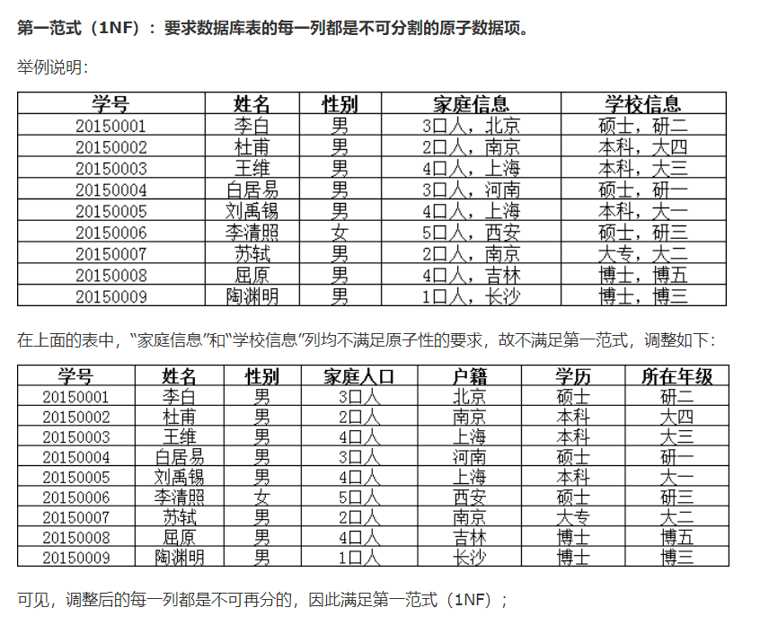
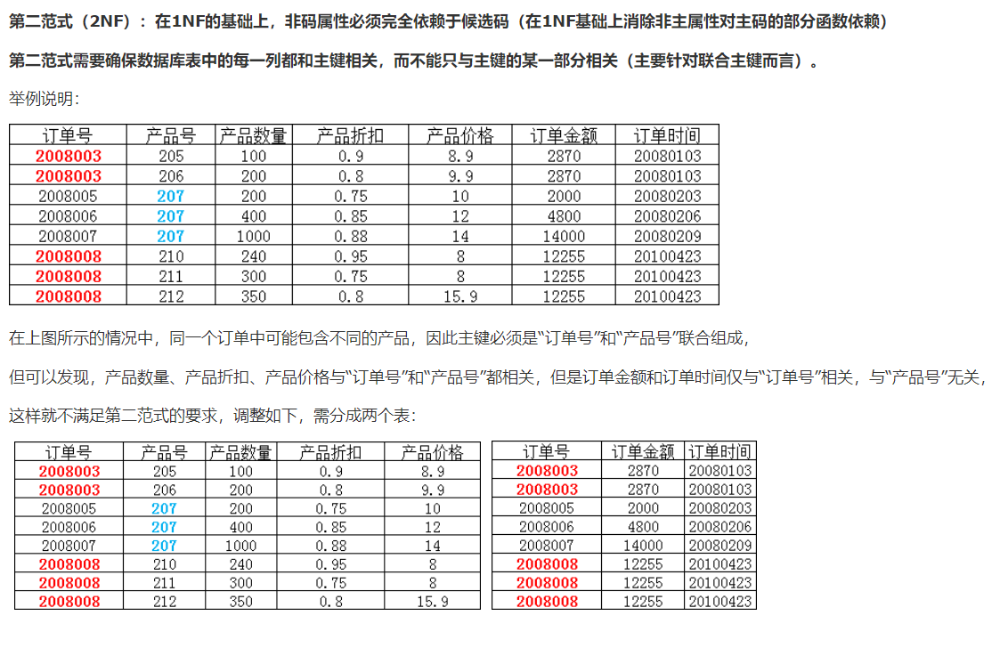
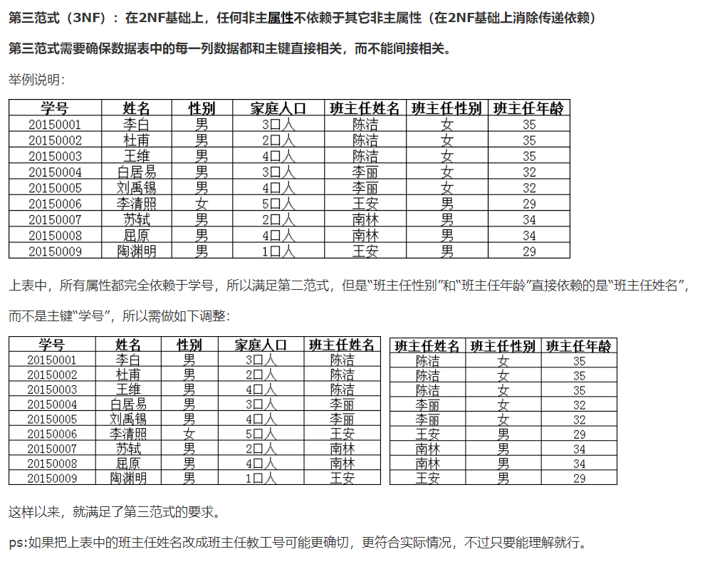

### 一，权限管理和备份

**1.用户管理**

> sql命令操作

mysql用户表：mysql-----user

```sql
use mysql

SHOW TABLES

--创建用户 CREATE USER 用户名  IDENTIFIED BY '密码'
CREATE USER jinronga IDENTIFIED BY '123456'

--修改密码（修改当前用户的密码
SET PASSWORD=PASSWORD('123456')


--修改指定用户的密码
SET PASSWORD FOR jinronga=PASSWORD('111111')


--给用户重命名RENAME USER 原来的名字 TO新的名字
RENAME USER  jinronga TO jinronga2

--用户授权
-ALL  PRIVILEGES 除了给别授权，其他都能干
GRANT ALL PRIVILEGES ON *.* TO jinronga2

--查看权限
--查看指定用户的权限：GRANT ALL PRIVILEGES ON *.* TO 'jinronga'@'%'
SHOW GRANTS FOR jinronga2
--查看管理员权限 ：GRANT ALL PRIVILEGES ON *.* TO 'root'@'localhost' WITH GRANT OPTION
SHOW GRANTS FOR root@localhost 

-- 撤销权限 REVOKE 哪些权限，在哪个库撤销，给谁撤销
REVOKE ALL PRIVILEGES ON *.* FROM jinronga2


---删除用户
DROP user jinronga2
```

### 2.mysql备份

**为什么要备份：**

- 保证重要的数据不丢失
- 数据转移A-----=->B

**Mysql数据库备份的方式**

直接拷贝物理文件

方式一：用可视化软件Navicat直接导出（数据与表结构）

方式二：使用命令行导出

```sql
-- 导出
-- mysqldump -h主机 -u用户名 -p密码 数据库名 表名 > 物理磁盘位置/文件名 
mysqldump -hlocalhost -uroot -p123456 school student >D:\student.sql
-- mysqldump -h主机 -u用户名 -p密码 数据库名 表名1 表2 > 物理磁盘位置/文件名 
mysqldump -hlocalhost -uroot -p123456 school student result >D:\student-2.sql

-- mysqldump -h主机 -u用户名 -p密码 数据库名 > 物理磁盘位置/文件名 
mysqldump -hlocalhost -uroot -p123456 school  >D:/student.sql

-- 导入
-- 登录的情况下，切换到指定的数据库
-- source 备份文件
mysql > source D:\1.sql
-- 非登录的情况下
mysql -u用户名 -p密码 数据名 < 备份文件
```

### 二，规范数据库设计

> **当我们的数据库比较复杂的时候，我们需要进行设计了**

**糟糕的数据库设计：**

1. 数据冗余，浪费空间
2. 数据库插入和删除都会比较麻烦，异常【屏蔽使用物理外键】
3. 程序的性能差

**良好的数据库设计：**

1. 节省内存空间
2. 保证数据库的完整性
3. 方便我们的系统开发

**软件开发中，关于数据库的设计**

分析需求：分析业务和需要处理的数据的需求

概要设计：设计关系图E-R图


### 设计数据库的步骤：（个人博客）

**收集信息，分析需求**

- 用户表（用户登录注销，用户的个人信息，写博客，创建分类）
- 分类表（文章分类，谁创建的）
- 文章表（文章的信息）
- 友链表（友链信息）
- 评论表
- 自定义表（系统信息，某个关键字，或者一些主字段）Key：value
- 说说表（发表感悟，发表心情..id..content...create_time）

**标识实体（把需求落到每一个字段）**

**标识实体之间的关系**

- 写博客：user----->blog
- 创建分类:user----->category
- 关注:user----->user
- 友链：links
- 评论：user----->user----->blog

**前端页面**

- antdesign
- elementui
- bootstrap

### 2.三大范式

**为什么需要数据规范化？**

信息重复

更新异常

插入异常

**无法显示正常的信息**

删除异常

丢失有效的信息

> 三大范式

原子性：保证每一列不可再分




**第二范式（2NF）**

前提：满足第一范式

每张表只描述一件事情



**第三范式（3NF）**

前提：满足第一范式和第二范式

第三范式需要确保数据表中的每一列数据都和主键直接相关，而不能间接相关。



**三大范式的目的：**规范数据库的设计

**规范性和性能问题**

阿里规范：关联查询的表不得超过三张表

- 考虑商业化的需求和目标，（成本，用户体验！）数据库的性能更加重要
- 在规范性能问题的时候，需要适当的考虑一下规范性
- 故意给某些表增加一些冗余的字段（从多表查询变为单表查询）
- 故意增加一些计算列（从大数据量降低为小数据量的查询，还有索引）

