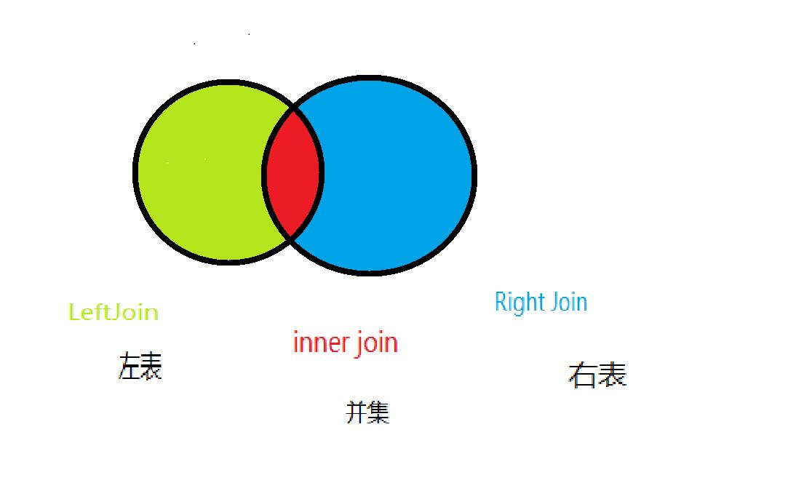
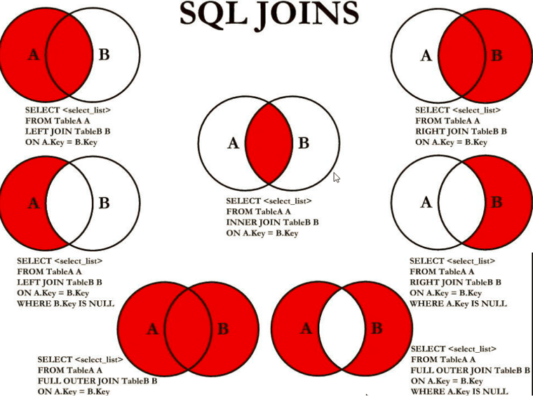
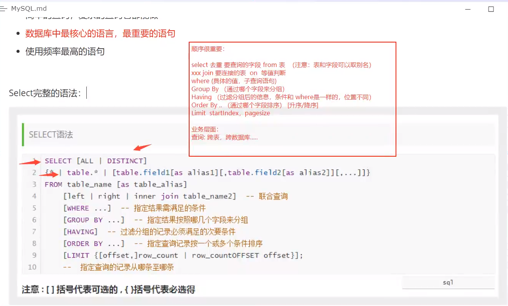

DQL查询语言（最重点）

### 1.DQL

(Data Query LANGUAGE:数据库查询语言

所有的查询语言操作都是用它：select

简单的查询，复杂的查询都能让它来做~

**数据库最核心的语言，最重要的语句**

使用频率最大的语句

### SELECT 完整语法：

```sql
SELECT [ALL|DISTINCT]
{*|table.*|[table.filed1[as alias1][,table.filed2[as alias2]][,...]]}
FROM table_name [as table_alias]
	[left|right|inner join table_name2...on...]  -- 联合查询
	[WHERE ...] -- 指定结果需满足的条件
	[GROUP BY ...] -- 指定结果按照哪几个字段来分组
	[HAVING] -- 过滤分组的记录必须满足的次要条件
	[ORDER BY ...] -- 指定查询记录按一个或多个条件排序
	[LIMIT {[offset,]row_count | row_countOFFSET offset}]; -- 指定查询的记录从哪条至哪条（分页）
```


### 2.指定查询字段

先导入sql文件：

 [scool.sql](scool.sql) 

```sql
--查询全部学生的   SELECT 字段 FROM 表
SELECT * FROM student

--查询指定的字段
SELECT  `StudentNo`,`studentName` FROM student

--别名 AS 给结果字段取一个名字也可以给表取别名
SELECT `StudentNo` AS 学号, `StudentName` AS 姓名 FROM student

--函数  Concat(a,b)拼接字符串
SELECT Concat('姓名：',StudentName)AS 新名字 FROM student
```

**格式语法**

> SELECT  字段1,字段2.... FROM 表

> 有的时候列字段不是那么见名知意。我们其别名 AS  字段名 as   别名  表名 as 别名


**去重distinct**

作用：去除select语句查询出来的结果中重复的数据，重复的数据显示一条

```sql
--查询一下有哪些同学参加了考试,成绩
SELECT * FROM `result`  --查询全部的考试成绩
SELECT `StudentNo` FROM result --查询那些同学参加了考试
SELECT DISTINCT `StudentNo` FROM result --发现重复的数据，去重DISTINCT
```

> 数据库的列（表达式）

```sql
--查询一下有哪些同学参加了考试,成绩
SELECT * FROM `result`  --查询全部的考试成绩
SELECT `StudentNo` FROM result --查询那些同学参加了考试
SELECT DISTINCT `StudentNo` FROM result --发现重复的数据，去重DISTINCT

SELECT VERSION() AS 版本号--查看数据库版本号(函数)
SELECT  100*3-1 AS 计算结果  --用来计算(表达式)
SELECT @@auto_increment_increment --查询自增的步长（变量）

--给所有学生的成绩都加1分查看
SELECT  `StudentNo`,`StudentResult`+1 AS 加一分后 FROM result
```

数据库中的表达式：文本值，列，NULL，函数，计算表达式，环境变量。。。

> select  表达式 from 表


#### **3.where条件子句**

作用：检索数据中**符合条件**的值


> 逻辑运算符

| 运算符   | 语法           | 描述                             |
| -------- | -------------- | -------------------------------- |
| and  &&  | a and b a&&b   | 逻辑与，两个都为真，结果为真     |
| or  \|\| | a or b  a\|\|b | 逻辑或，其中一个为真，则结果为真 |
| Not  !   | not a !a       | 逻辑非，真为假，假为真           |

**注意：**尽量使用字母！

```sql
 --------------------where---------------------
--查询考试成绩95~100分之间（3种）
--用AND
SELECT `StudentNo`,`StudentResult` AS 成绩 FROM result where `StudentResult` >=95 AND `StudentResult`<=100

--用&&
SELECT `StudentNo`,`StudentResult` AS 成绩 FROM result where `StudentResult` >=95 && `StudentResult`<=100

--模糊查询(区间)
SELECT studentNo, `StudentResult` AS 成绩 FROM result where StudentResult BETWEEN 95 AND 100

--除了学号1000学生之外的同学成绩
--使用 !=
SELECT studentNo,`StudentResult`AS 成绩 FROM result WHERE studentNo !=1000
--使用not
SELECT studentNo,`StudentResult`AS 成绩 FROM  result WHERE NOT studentNo = 1000 
```


> **模糊查询：**比较运算符

| 运算符      | 语法                 | 描述                                    |
| ----------- | -------------------- | --------------------------------------- |
| IS NULL     | a is null            | 如果操作符为null，结果为真              |
| IS NOT NULL | a is not null        | 如果操作符不为null，结果为真            |
| BETWEEN     | a between b and c    | 若在b和c之间，则结果为真                |
| **Like**    | a like b             | sql匹配，如果a匹配b，则结果为真         |
| **In**      | a in（a1,a2,a3....） | 假设a在a1,或者a2...其中一个值，结果为真 |

like： 小红 like '红xxxx' 返回真

```sql
--===========模糊查询======================--
--查询姓刘的同学
--like 结合 %（代表0到任意个字符） _（一个字符）
SELECT `studentNo`,`studentName` FROM student WHERE studentName LIKE '刘%'

--查询姓刘，名字后面一个字的
SELECT `studentNo`,`studentName` FROM student   WHERE studentName LIKE '刘_'
 
 --查询名字中间有峰字的同学 %峰%
 SELECT `studentNo`,`studentName` FROM student  WHERE studentName LIKE '%峰%'
  
 ---查询所有在北京的学生
  SELECT `studentNo`,`studentName` ,`address` AS 地址 FROM student  WHERE `address` LIKE ('北京%')
 
--========in===============---
--查询学号 1001 1002 1003的学生  in的具体的值或者多个值
 SELECT `studentNo`,`studentName` FROM student WHERE `studentNo` in (1001,1002,1003)
--===null not null===----
--查找地址为null的学生 ''
 SELECT `studentNo`,`studentName`,`address`  FROM student WHERE `address` is null or address=''
 
 --查找有出生日期的同学 不为空 
  SELECT `studentNo`,`studentName`,`address` ,`BornDate` FROM student  WHERE `BornDate` is NOT NULL
```


#### **4.连表查询join**

含义：又称多表查询，当查询的字段来自于多个表时，就会用到连接查询

笛卡尔乘积现象：表1 有m行，表2有n行，结果=m*n行

发生原因：没有有效的连接条件
如何避免：添加有效的连接条件

分类：

按年代分类：
sql92标准:仅仅支持内连接
sql99标准【推荐】：支持内连接+外连接（左外和右外）+交叉连接

按功能分类：
	内连接：
		等值连接
		非等值连接
		自连接
	外连接：
		左外连接
		右外连接
		全外连接
	    交叉连接



**七种join理论**



```sql
--======连表查询join==========---
 --查询参加了考试的同学(学号，姓名，科目编号，分数)
 
 SELECT * FROM student 
 
 SELECT * FROM result
  
	/*思路：
	1.分析需求，分析查出来的字段来自哪些表，（连接查询）
	2.确定使用哪一种连接？ 7种
	确定交叉点（这两张表那个数据是相同的）
	判断的条件：学生表中 studentNo= 成绩表 studentNo
	
	*/
	join （连接的表） on（判断的条件） 连接查询
	where 等值查询
	-- INNER JOIN 并集查询（内连接）
SELECT s.studentNo,studentName,SubjectNo,StudentResult 
FROM student AS s INNER JOIN result AS r
ON s.studentNo =r.studentNo

	--Right Join右连接
SELECT s.studentNo,studentName,SubjectNo,StudentResult 
FROM student AS s Right JOIN result AS r
ON s.studentNo =r.studentNo


	--left Join左连接
SELECT s.studentNo,studentName,SubjectNo,StudentResult 
FROM student AS s left Join result AS r
ON s.studentNo =r.studentNo
```

| 操作       | 描述                                       |
| ---------- | ------------------------------------------ |
| Inner join | 如果标准至少有一个匹配，就返回值           |
| left join  | 也会从左表中返回所有的值，即使右边没有匹配 |
| right join | 也会从右表中返回所有的值，即使左边没有匹配 |

```sql
--查询缺考的同学
SELECT s.studentNo,studentName,SubjectNo,StudentResult 
FROM student AS s left Join result AS r
ON s.studentNo =r.studentNo   where studentResult IS NULL
--思考题（查询了参加考试的同学信息，学号，学生姓名，科目名，分数）

	/*思路：
	1.分析需求，分析查出来的字段来自哪些表，student ,result ,subject（连接查询）
	2.确定使用哪一种连接？ 7种
	确定交叉点（这两张表那个数据是相同的）
	判断的条件：学生表中 studentNo= 成绩表 studentNo
	*/
	
	SELECT s.StudentNo,studentName,SubjectName,StudentResult
	FROM student AS s left JOIN result AS r
	ON s.StudentNo=r.StudentNo 
 INNER JOIN  `subject` AS sub
 ON r.SubjectNo=sub.SubjectNo
 
 --我要查那些字段数据select ....
--从那些表查 FROM 表 xxx Join 连接的表 on  交叉条件
--假设存在一种多张表查询，慢慢来，先查询两张表然后慢慢添加


--FROM a left join b --以a表为基准
--FROM  a right join b --以b表为基准

```


**5.自连接：**

> 自连接：（了解即可）
>
> 创建表并插入数据

```sql
--===================自连接===================-------
CREATE TABLE `category`(
	`categoryid` INT(10) UNSIGNED NOT NULL AUTO_INCREMENT COMMENT '主题id',
	`pid` INT(10) NOT NULL COMMENT '父id',
	`categoryName` VARCHAR(50) NOT NULL COMMENT '主题名字',
	PRIMARY KEY(`categoryid`)
)ENGINE=INNODB AUTO_INCREMENT=9 DEFAULT CHARSET=utf8

INSERT INTO `category`(`categoryid`,`pid`,`categoryName`)
VALUES (2,1,'信息技术'),
(3,1,'软件开发'),
(4,3,'数据库'),
(5,1,'美术设计'),
(6,3,'web开发'),
(7,5,'ps技术'),
(8,2,'办公信息');
```

自己的表跟自己的表连接，核心：**一张表拆为两张一样的表既可**

 **父类：** 

| categoryid | categoryName |
| ---------- | ------------ |
| 2          | 信息技术     |
| 3          | 软件开发     |
| 5          | 美术设计     |
|            |              |

**子类** ： 子类的pid就是categoryid

| pid  | categoryid | categoryName |
| ---- | ---------- | ------------ |
| 3    | 4          | 数据库       |
| 3    | 6          | web开发      |
| 2    | 8          | 办公信息     |
| 5    | 7          | ps技术       |

**操作：**查询父类的子关系

| 父类     | 子类     |
| -------- | -------- |
| 信息技术 | 办公信息 |
| 软件开发 | 数据库   |
| 软件开发 | web开发  |
| 美术设计 | ps技术   |

**演示：**

```sql
--查找父子信息:把一张表分为两张表

SELECT a.`categoryName` AS 父栏目,b.`categoryName`AS 子栏目
FROM `category` AS a,`category` AS b  WHERE a.`categoryid`=b.`pid`
```


**6.分页和排序**

> 排序：ORDER BY  升序ASC ,降序DESC

```sql
--排序：升序ASC ,降序DESC
--ORDER BY 给字段排序 怎么排

--查询结果根据 成绩降序 排序
SELECT s.`StudentNo`,`StudentName`,`SubjectName`,`StudentResult`
FROM`student` AS s LEFT JOIN `result` AS r
ON s.StudentNo=r.StudentNo
INNER JOIN `subject` AS sub 
ON r.SubjectNo=sub.SubjectNo
WHERE SubjectName='数据库结构-1'
ORDER BY   `StudentResult` DESC

```

案例二：来自--- [myemployees.sql](https://gitee.com/jinronga/study-notes/blob/master/mysql笔记/myemployees.sql)

```sql
#1、等值连接
#案例1.查询员工名、部门名
SELECT last_name,department_name
FROM  departments as d INNER JOIN employees as e
ON d.`department_id`=e.`department_id`


#案例2.查询名字中包含e的员工名和工种名（添加筛选）
SELECT e.last_name,department_name
FROM  departments as d INNER JOIN employees as e
ON d.`department_id`=e.`department_id`
WHERE e.last_name LIKE '%e%'


#3. 查询部门个数>3的城市名和部门个数，（添加分组+筛选）

#①查询每个城市的部门个数
#②在①结果上筛选满足条件的
SELECT city,COUNT(*) 部门个数
FROM departments d
INNER JOIN locations l
ON d.`location_id`=l.`location_id`
GROUP BY city
HAVING COUNT(*)>3;

#案例4.查询哪个部门的员工个数>3的部门名和员工个数，并按个数降序（添加排序）

#①查询每个部门的员工个数
SELECT COUNT(*),department_name
FROM employees e
INNER JOIN departments d
ON e.`department_id`=d.`department_id`
GROUP BY department_name

#② 在①结果上筛选员工个数>3的记录，并排序

SELECT COUNT(*) 个数,department_name
FROM employees e
INNER JOIN departments d
ON e.`department_id`=d.`department_id`
GROUP BY department_name
HAVING COUNT(*)>3
ORDER BY COUNT(*) DESC;

#5.查询员工名、部门名、工种名，并按部门名降序（添加三表连接）

SELECT last_name,department_name,job_title
FROM employees e
INNER JOIN departments d ON e.`department_id`=d.`department_id`
INNER JOIN jobs j ON e.`job_id` = j.`job_id`

ORDER BY department_name DESC;

#二）非等值连接

#查询员工的工资级别

SELECT salary,grade_level
FROM employees e
 JOIN job_grades g
 ON e.`salary` BETWEEN g.`lowest_sal` AND g.`highest_sal`;
 
 
 #查询工资级别的个数>20的个数，并且按工资级别降序
 SELECT COUNT(*),grade_level
FROM employees e
 JOIN job_grades g
 ON e.`salary` BETWEEN g.`lowest_sal` AND g.`highest_sal`
 GROUP BY grade_level
 HAVING COUNT(*)>20
 ORDER BY grade_level DESC;
 
 
 #三）自连接
 
 #查询员工的名字、上级的名字
 SELECT e.last_name,m.last_name
 FROM employees e
 JOIN employees m
 ON e.`manager_id`= m.`employee_id`;
 
  #查询姓名中包含字符k的员工的名字、上级的名字
 SELECT e.last_name,m.last_name
 FROM employees e
 JOIN employees m
 ON e.`manager_id`= m.`employee_id`
 WHERE e.`last_name` LIKE '%k%';
 
 
 #二、外连接
 
 /*
 应用场景：用于查询一个表中有，另一个表没有的记录
 
 特点：
 1、外连接的查询结果为主表中的所有记录
	如果从表中有和它匹配的，则显示匹配的值
	如果从表中没有和它匹配的，则显示null
	外连接查询结果=内连接结果+主表中有而从表没有的记录
 2、左外连接，left join左边的是主表
    右外连接，right join右边的是主表
 3、左外和右外交换两个表的顺序，可以实现同样的效果 
 4、全外连接=内连接的结果+表1中有但表2没有的+表2中有但表1没有的
 */
 #引入：查询男朋友 不在男神表的的女神名
 
 SELECT * FROM beauty;
 SELECT * FROM boys;
 
 #左外连接
 SELECT b.*,bo.*
 FROM boys bo
 LEFT OUTER JOIN beauty b
 ON b.`boyfriend_id` = bo.`id`
 WHERE b.`id` IS NULL;
 
 
 #案例1：查询哪个部门没有员工
 #左外
 SELECT d.*,e.employee_id
 FROM departments d
 LEFT OUTER JOIN employees e
 ON d.`department_id` = e.`department_id`
 WHERE e.`employee_id` IS NULL;
 
 
 #右外
 
  SELECT d.*,e.employee_id
 FROM employees e
 RIGHT OUTER JOIN departments d
 ON d.`department_id` = e.`department_id`
 WHERE e.`employee_id` IS NULL;
 
 
 #全外
 
 
 USE girls;
 SELECT b.*,bo.*
 FROM beauty b
 FULL OUTER JOIN boys bo
 ON b.`boyfriend_id` = bo.id;
 

 #交叉连接
 
 SELECT b.*,bo.*
 FROM beauty b
 CROSS JOIN boys bo;
 
 
 
 #sql92和 sql99pk
 /*
 功能：sql99支持的较多
 可读性：sql99实现连接条件和筛选条件的分离，可读性较高
 */
```


> 分页

```sql
--假如数据有100万数据
--为什么要分页？
--缓解数据库的压力，给用户更加好的体验，  还有瀑布流适合用于图片

--分页，每页只显示五条数据
--语法，limit 启始值,页面的大小 LIMIT 0,5
--网页应用：当前，总的页数，页面的大小
--LIMIT 0,5 一到五


SELECT s.`StudentNo`,`StudentName`,`SubjectName`,`StudentResult`
FROM`student` AS s LEFT JOIN `result` AS r
ON s.StudentNo=r.StudentNo
INNER JOIN `subject` AS sub 
ON r.SubjectNo=sub.SubjectNo
WHERE SubjectName='数据库结构-1'
ORDER BY   `StudentResult` DESC
LIMIT 0,5 
--第一页  LIMIT 0,5
--第二页  LIMIT 5,5
--第三页  LIMIT 10,5
--第N页   LIMIT (n-1)*pageSize,pageSize
--[pageSize:页面大小，n当前页]
--[(n-1)*pageSize起始值]
--[n:当前页]


```

格式语法：**limit(查询起始值 ，页面大小)**

**思考题：**

--查询Java第一学年课程成绩排名前十的学生，并且分数要大于80的学生信息（学号，姓名，课程编号，分数）

```sql
--查询Java第一学年课程成绩排名前十的学生，并且分数要大于80的学生信息（学号，姓名，课程编号，分数）
SELECT s.`StudentNo`,`StudentName`,`SubjectName`,`StudentResult` 
FROM `student` AS s INNER JOIN  `result` AS r
ON s.StudentNo=r.StudentNo
INNER JOIN `subject` 	AS sub
ON r.SubjectNo=sub.SubjectNo
WHERE `SubjectName`='JAVA第一学年' AND `StudentResult`>=80
ORDER BY `StudentResult` DESC
LIMIT 0,10
```

**7.子查询**

where（这个值是计算出来的）

本质：

```sql
--1.查询数据库结构-1的所有考试结果(学号，科目编号，成绩），降序排列
--方式一使用连接查询
SELECT  `StudentNo`,r.`SubjectNo`,`StudentResult`
FROM `result` AS r INNER JOIN `subject` AS sub
ON r.SubjectNo=sub.SubjectNo
WHERE SubjectName='数据库结构-1'
ORDER BY `StudentResult` DESC

```

**使用子查询**

```sql
--方式二：使用子查询（）
SELECT `StudentNo`,`SubjectNo`,`StudentResult`
FROM `result`
WHERE(
  SELECT `SubjectNo`
	FROM `subject` WHERE SubjectName='数据库结构-1'
)
ORDER BY `StudentResult` DESC


--分数不小于80分的学生的学号和姓名
SELECT  s.StudentNo,StudentName ,StudentResult FROM 
`student` AS s INNER JOIN `result`AS r
ON s.StudentNo=r.StudentNo
WHERE StudentResult>=80
--在这个基础上添加一个科目，高等数学-2的
SELECT DISTINCT s.StudentNo,StudentName ,StudentResult FROM 
`student` AS s INNER JOIN `result`AS r
ON s.StudentNo=r.StudentNo
WHERE StudentResult>=80 AND `SubjectNo`=(SELECT SubjectNo FROM `subject` WHERE SubjectName='高等数学-2')


--查询 课程为高等数学-2 并且分数不小于80的同学的学号姓名
SELECT s.`StudentNo`,`StudentName` ,`StudentResult`,`SubjectName` FROM 
`student` AS s INNER JOIN `result` AS r
INNER JOIN
`subject` AS sub
ON r.SubjectNo=sub.SubjectNo
WHERE `SubjectName`='高等数学-2'  AND  StudentResult>=80
 
--在改造（先执行里面的，在执行外面的）
SELECT  StudentNo,StudentName FROM student WHERE StudentNo IN(
SELECT StudentNo FROM result WHERE StudentResult>80 AND SubjectNo=(
    SELECT SubjectNo FROM `subject` WHERE `SubjectName`='高等数学-2'
)
)

```

#### 分组和过滤

语法：

select 查询列表
from 表
【where 筛选条件】
group by 分组的字段
【order by 排序的字段】;

**特点：**
1、和聚合函数一同查询的字段必须是group by后出现的字段
2、筛选分为两类：分组前筛选和分组后筛选
		针对的表			位置		连接的关键字
分组前筛选	原始表				group by前	where分组后筛选	group by后的结果集    		group by后	having

问题1：聚合函数做筛选能不能放在where后面
答：不能

问题2：where——group by——having

一般来讲，能用分组前筛选的，尽量使用分组前筛选，提高效率

3、分组可以按单个字段也可以按多个字段
4、可以搭配着排序使用

以下查询文件来自：

[myemployees.sql](https://gitee.com/jinronga/study-notes/blob/master/mysql笔记/myemployees.sql)

```sql
#查询某个部门的员工个数：
SELECT COUNT(*) FROM employees WHERE department_id=90
#1.简单的分组
#案例1：查询每个工种的员工平均工资
SELECT avg(salary),job_id 
FROM employees GROUP BY job_id

#案例2：查询每个位置的部门个数：
SELECT COUNT(*),location_id FROM 
departments GROUP BY  location_id

#2、可以实现分组前的筛选
#案例1：查询邮箱中包含a字符的 每个部门的最高工资
SELECT MAX(salary),department_id FROM employees 
WHERE `email` LIKE  '%a%' GROUP BY  department_id

#案例2：查询有奖金的每个领导手下员工的平均工资
SELECT AVG(salary),manager_id FROM 
employees WHERE commission_pct is not NULL 
GROUP BY manager_id

#3、分组后筛选
#案例：查询哪个部门的员工个数>5
#①查询每个部门的员工个数
SELECT COUNT(*),department_id
FROM employees GROUP BY department_id

#② 筛选刚才①结果
SELECT COUNT(*),department_id
FROM employees GROUP BY department_id
HAVING COUNT(*)>5

#案例2：每个工种有奖金的员工的最高工资>12000的工种编号和最高工资

SELECT job_id,MAX(salary)
FROM employees
WHERE commission_pct IS NOT NULL
GROUP BY job_id
HAVING MAX(salary)>12000;

#4.添加排序

#案例：每个工种有奖金的员工的最高工资>6000的工种编号和最高工资,按最高工资升序

SELECT job_id,MAX(salary) m
FROM employees
WHERE commission_pct IS NOT NULL
GROUP BY job_id
HAVING m>6000
ORDER BY m ;


#5.按多个字段分组

#案例：查询每个工种每个部门的最低工资,并按最低工资降序

SELECT MIN(salary),job_id,department_id
FROM employees
GROUP BY department_id,job_id
ORDER BY MIN(salary) DESC;
```


> **分组和过滤(筛选)**
>
> -- GROUP BY:通过什么字段进行分组
> --HAVING ：分组后用HAVING 过滤 不能使用where了  条件跟where是一样的只是位置不一样

```sql
--查询不同课程的平均分，最高分，最低分
SELECT  SubjectName AS 课程名：,AVG(StudentResult) AS 平均分：,MAX(StudentResult) AS 最高分：,MIN(StudentResult) AS 最低分
FROM result AS r  INNER JOIN `subject` AS sub
ON r.SubjectNo=sub.SubjectNo
 GROUP BY r.SubjectNo 
 HAVING AVG(StudentResult)>=80
```


#### **8.mysql常用函数：**

**概念：**类似于java的方法，将一组逻辑语句封装在方法体中，对外暴露方法名
**好处：**1、隐藏了实现细节  2、提高代码的重用性
调用：select 函数名(实参列表) 【from 表】;
特点：
	①叫什么（函数名）
	②干什么（函数功能）

分类：
	1、单行函数
	如 concat、length、ifnull等
	2、分组函数
	功能：做统计使用，又称为统计函数、聚合函数、组函数


```sql
--=======常用函数=======---
SELECT ABS(-8) --绝对值
SELECT CEILING(9.4)--向上取整
SELECT FLOOR(9.4)  --向下取整
SELECT RAND()--返回一个0~1之间的随机数
SELECT SING(10) --判断一个数的符号0-0 负数返回-1，正数返回1

--字符串函数
SELECT CHAR_LENGTH('即使再小的船') --字符串长度
SELECT  CONCAT('我','爱你','你们')---字符串拼接
SELECT INSERT('我爱编程hello world',1,2,'超级热爱')--插入输入，从某个位置开始替换某个长度
SELECT LOWER('LINUHUAN')--小写字母
SELECT UPPER('liuhuan')  -- 大写字母
SELECT INSTR('liuhaun','h') -- 返回第一次出现的子串的索引
SELECT REPLACE('刘欢说坚持就能成功','坚持','努力') -- 替换出现的指定字符串	
SELECT SUBSTR('刘欢说坚持就能成功',4,6) -- 返回指定的子字符串（源字符串，截取的位置，截取的长度）
SELECT REVERSE('刘欢说坚持就能成功') -- 反转


-- 查询姓 周 的同学换成 邹
SELECT REPLACE(`StudentName`,'周','邹')
FROM `student`
WHERE `StudentName` LIKE '周%'


-- 时间和日期函数（重要，记住！！！）
SELECT CURRENT_DATE() -- 获取当前日期
SELECT CURDATE() -- 获取当前日期
SELECT NOW()  -- 获取当前时间
SELECT LOCALTIME()  -- 本地时间
SELECT SYSDATE()  -- 系统时间
SELECT YEAR(NOW()) --年
SELECT MONTH(NOW()) --月
SELECT DAY(NOW()) --日
SELECT HOUR(NOW())--时
SELECT MINUTE(NOW())--分
SELECT SECOND(NOW()) --秒
--str_to_date 将字符通过指定的格式转换为日期：
SELECT STR_TO_DATE("2020-5-22","%Y-%c-%d")
#查询入职日期为1992--4-3的员工信息
SELECT * FROM employees WHERE hiredate = '2020-4-3';

SELECT * FROM employees WHERE hiredate = STR_TO_DATE('4-3 2020','%c-%d %Y');

#date_format 将日期转换成字符
SELECT DATE_FORMAT(NOW(),'%Y年%m月%d日')

#查询有奖金的员工名和入职日期(xx月/xx日 xx年)
SELECT last_name,DATE_FORMAT(hiredate,'%m月/%d日 %y年') 入职日期
FROM employees
WHERE commission_pct IS NOT NULL;


-- 系统
SELECT SYSTEM_USER() -- 数据库当前的用户
SELECT USER() -- 数据库当前的用户
SELECT VERSION() -- 数据库当前的版本


```

**9.聚合函数（常用）**

| 函数名称    | 描述   |
| ----------- | ------ |
| **COUNT()** | 计数   |
| SUM()       | 求和   |
| AVG()       | 平均值 |
| MAX()       | 最大值 |
| MIN()       | 最小值 |
| .....       | ...... |

```sql
--=======聚合函数=========---
SELECT COUNT(`StudentName`) FROM `student` --COUNT(字段)，会忽略所有的null值

SELECT COUNT(*) FROM `student`  --COUNT(*),不会忽略null值    本质 计算行数

SELECT COUNT(1) FROM result --COUNT(1),不会忽略所有的null值   本质  计算行数

--总和 SUM('字段')
SELECT SUM(`StudentResult`) AS 总和 FROM  `result`
--平均值：AVG('字段')
SELECT AVG(`StudentResult`) AS 平均分FROM  `result`
--MAX('最大值')
SELECT MAX(`StudentResult`) AS 最高分 FROM `result`
--MIN('最低分')
SELECT MIN(`StudentResult`) AS 最低分 FROM `result`
```


**10.数据库级别的MD5加密（扩展）**

什么是MD5?

主要加强算法复杂度和不可逆性。

MD5破解网站的原理，背后有一个字典，MD5加密后的值，加密前的值

```sql
--========测试MD5 加密=======
 
 CREATE TABLE `testmd5`(
   `id` INT(4) NOT NULL AUTO_INCREMENT,
	 `name` VARCHAR(30) NOT NULL,
	 `pwd` VARCHAR(50) NOT NULL,
	 PRIMARY KEY (`id`)
 )ENGINE=INNODB  DEFAULT CHARSET=utf8
 
--插入数据
--明文密码
INSERT into `testmd5`(`name`,`pwd`)VALUES('test1','123456'),('test2','1234df56'),('test3','1234fd56'),('test4','123f456'),('test5','12345d6')
--给id为1的pwd进行md5加密
UPDATE  `testmd5` set `pwd`=MD5(pwd) WHERE id=1
--加密全部pwd
UPDATE  `testmd5` set pwd=MD5(pwd)

--插入的时候进行加密
INSERT into `testmd5`(`name`,`pwd`)VALUES('xx',MD5('456456'))
--如何验证：将用户传进来的密码进行md5加密，然后对比加密后的值
INSERT into `testmd5`(`name`,`pwd`)VALUES('小红',MD5(123456))

--如何验证：将用户传进来的密码进行md5加密，然后对比加密后的值
SELECT `id`,`name`,`pwd`FROM testmd5 WHERE name='小红' and pwd=MD5('123456')
 
```


#### select小结：

语法顺序要正确：

```sql
SELECT [ALL|DISTINCT]
{*|table.*|[table.filed1[as alias1][,table.filed2[as alias2]][,...]]}
FROM table_name [as table_alias]
	[left|right|inner join table_name2...on...]  -- 联合查询
	[WHERE ...] -- 指定结果需满足的条件
	[GROUP BY ...] -- 指定结果按照哪几个字段来分组
	[HAVING] -- 过滤分组的记录必须满足的次要条件
	[ORDER BY ...] -- 指定查询记录按一个或多个条件排序
	[LIMIT {[offset,]row_count | row_countOFFSET offset}]; -- 指定查询的记录从哪条至哪条（分页）
```





***\*分享一下我学习编程的途径希望大家循序渐进，共同进步：\****

[How2J 的 Java教程](https://how2j.cn?p=80103)：当下Java小白的引路人，以有趣和好理解的方式展示Java和Web的内容拥有当今流行的java路线。

[哔哩哔哩 (゜-゜)つロ 干杯~-bilibili](https://www.bilibili.com/)：中国最大的学习平台没有之一，拥有海量的资源有时间的小伙伴可以免去重金花钱培训。

[廖雪峰的官方网站](https://www.liaoxuefeng.com)：**廖雪峰**,十年软件开发经验,业余产品经理,精通Java/Python/Ruby/Scheme/Objective C等,对开源框架有深入研究..

 

[菜鸟教程 - 学的不仅是技术,更是梦想!](https://www.runoob.com/)：提供了编程的基础技术教程, 介绍了HTML、CSS、Javascript、Python,Java,Ruby,C,PHP , MySQL等各种编程语言的基础知识。