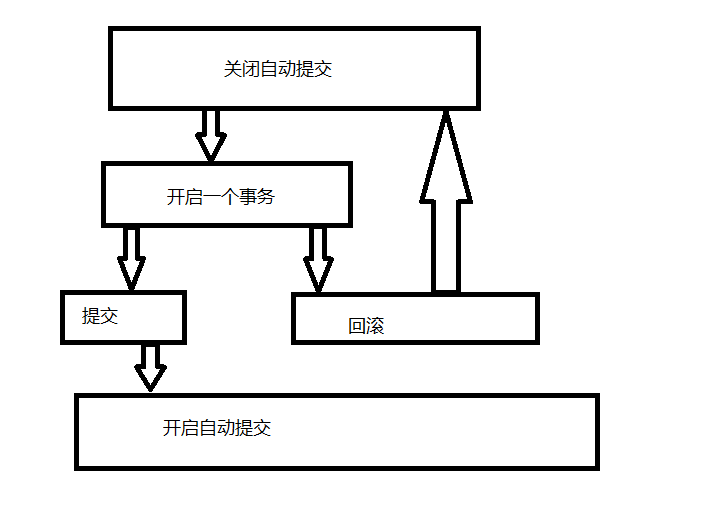
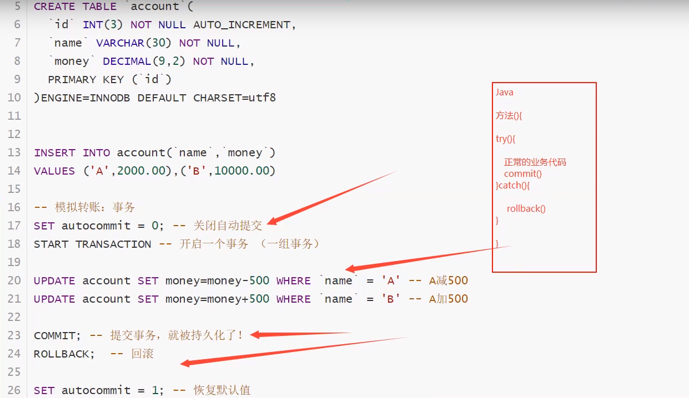

### 一，事务

1.什么是事务

要么成功，要么失败

事务是保证多个SQL操作的一致性，如果一条失败全部SQL也将失效。

----------

1.sql执行  A给B转账  A 1000    ---->200  B 200

2.sql执行 B收到A的钱    A 800   ------->B   400

-----------------------------------

- 将一组sql放在同一个批次中去执行~如果一条失败全部SQL也将失效。
- 实际业务中大多数是对多个表操作，比如当发表文章时需要将文章的基本信息发到文章基础表和文章内容添加到文章内容表，这种情况不使用事务也没有关系，如果出现数据异常重新添加就可以了
- 但牵涉到货币的情况就必须使用事务了，必须保证货币处理是准确的
- 当然有些公司要求所有查询都使用事务，这就遵照公司要求完成就可以了

> 事务原则：ACID原则 **原子性，一致性，隔离性，持久性**    （脏读，幻读）

参考博客连接：https://blog.csdn.net/u010651249/article/details/83863147

**原子性（Atomicity）**

要么都成功，要么都失败

**一致性（Consistency）**

事务前后的数据必须保证一致，1000

**持久性（Durability）**--事务提交

事务一旦提交不可逆，被持久化到数据库中！

**隔离性(Isolation）**

事务的隔离性是多个用户并发访问数据库，数据库为每一个用户开启事务，不能被其他操作数据所干扰事务之间要互相隔离。

> 隔离所导致的问题

### 脏读：

指一个事务读取了另外一个事务未提交的数据。

### 不可重复读：

在一个事务内读取表中的某一行数据，多次读取结果不同。（这个不一定是错误，只是某些场合不对）

### 虚读(幻读)

是指在一个事务内读取到了别的事务插入的数据，导致前后读取不一致。
（一般是行影响，多了一行）

> 执行事务

```sql
--===========事务=============--
--mysql是默认开启事务自动提交的
SET autocommit=0 /*关闭*/
SET autocommit=1 /*开启（默认的）*/

--手动开启事务
SET autocommit=0 --关闭自动提交
--事务开启
START TRANSACTION --标记一个事务的开启

INSERT xxx
INSERT xxx
--提交：持久化(成功！)
COMMIT
--回滚：回到的原来的样子（失败！）
ROLLBACK 
--事务结束
SET autocommit=1 --开启自动提交

--了解
SAVEPOINT 保存点名 --设置一个事务的保存点
ROLLBACK TO SAVEPOINT --保存点名 --回滚到保存点
RELEASE SAVEPOINT --撤销保存点
```

> 执行事务案例



```sql
--转账
CREATE DATABASE `shop` CHARACTER SET utf8 COLLATE utf8_general_ci
USE shop

CREATE TABLE `accout`(
    `id` INT(3) NOT NULL AUTO_INCREMENT,
		`name` VARCHAR(30)NOT NULL,
		`money`DECIMAL(9,2)NOT NULL,
		PRIMARY KEY(`id`)
)ENGINE=INNODB DEFAULT CHARSET=utf8

--模拟转账：事务
SET autocommit = 0;--关闭自动提交
START TRANSACTION --开启一个事务（一组事务）
INSERT INTO `accout`(`name`,`money`)VALUES('A',20000.00),('B',10000.00)
UPDATE `accout` set `money`=`money`-500 WHERE `name`='A' ;
UPDATE `accout` set `money`=`money`+500 WHERE `name`='B'

COMMIT; --提交事务被持久化了！
ROLLBACK; --回滚


SET autocommit=1;--恢复默认值
 
```




#### 事务隔离级别：

**有四种隔离级别，分别是读未提交（Read uncommitted），读已提交（Read committed），可重复读（Repeatable read），可串行化（Serializable），用来解决数据库操作中产生的各种问题。**

**一、读未提交（Read uncommitted）**

在这种隔离级别下，所有事务能够读取其他事务未提交的数据。读取其他事务未提交的数据，会造成脏读。因此在该种隔离级别下，不能解决脏读、不可重复读和幻读。

读未提交可能会产生脏读的现象，那么怎么解决脏读呢？那就是使用读已提交

##### 二、读已提交（Read committed）

在这种隔离级别下，所有事务只能读取其他事务已经提交的内容。能够彻底解决脏读的现象。但在这种隔离级别下，会出现一个事务的前后多次的查询中却返回了不同内容的数据的现象，也就是出现了不可重复读。

已提交可能会产生不可重复读的现象，我们可以使用可重复读。

##### 三、可重复读（Repeatable read）

在这种隔离级别下，所有事务前后多次的读取到的数据内容是不变的。也就是某个事务在执行的过程中，不允许其他事务进行update操作，但允许其他事务进行add操作，造成某个事务前后多次读取到的数据总量不一致的现象，从而产生幻读。

注意【1】这才是mysql的默认事务隔离级别

可重复读依然会产生幻读的现象，此时我们可以使用串行化来解决。

##### 四、可串行化（Serializable）

在这种隔离级别下，所有的事务顺序执行，所以他们之间不存在冲突，从而能有效地解决脏读、不可重复读和幻读的现象。但是安全和效率不能兼得，这样事务隔离级别，会导致大量的操作超时和锁竞争，从而大大降低数据库的性能，一般不使用这样事务隔离级别。

##### 下面用一张表格来表示他们能够解决的问题

| 隔离级别                     | 脏读      | 不可重复读 | **幻读** |
| ---------------------------- | --------- | ---------- | -------- |
| 读未提交（Read uncommitted） | ×(未解决) | ×          | ×        |
| 读已提交（Read committed）   | √(解决)   | ×          | ×        |
| 可重复读（Repeatable read）  | √         | √          | ×        |
| 可串行化（Serializable）     | √         | √          | √        |


### 二，索引

> Mysql官方对索引的定义为：索引（Index）是帮助Mysql快速高效获取数据的结构，提取句子骨干，就可以得到索引的本质：索引是数据结构

**1.索引的分类**

> **在一个表中，主键索引只能有一个，唯一索引可以有多个**


- **主键索引（PRIMARY KEY）**

 唯一的标识，主键不可以重复，只能有一个列作为主键

- **唯一索引（UNIQUE　KEY）**

避免重复的列出现，唯一索引可以重复，多个列都可以标识 为唯一索引

- **常规索引（KEY/INDEX）**

默认的，index或者key关键字来设置

- **全文索引（FullText）**

在指定的数据库下的引擎下有，MyISAM,快速定位数据---**现在 都有了**

> 语法格式：

```sql
 
 ----============索引============--
 --索引的使用
 --1.在建表的时候给字段添加索引
 --2.创建完毕添加索引
 
 
 --1.显示表所有的索引信息
 SHOW INDEX FROM student
 
 --添加一个全文索引   索引名称（类名）
 ALTER  TABLE `student` ADD FULLTEXT INDEX `StudentName`(`StudentName`)
 
 --EXPLAIN 分析sql的执行情况
 EXPLAIN SELECT * FROM student
 
 EXPLAIN SELECT * FROM  student WHERE MATCH(StudentName) AGAINST('刘')
```

### 2.测试索引

> 创建的`app_user`表中  **UNSIGNED** 表示该字段插入数据不能为负数

```sql
CREATE TABLE `app_user`(
        --UNSIGNED不能为负数
	`id` BIGINT(20) UNSIGNED NOT NULL AUTO_INCREMENT,
	`name` VARCHAR(50) DEFAULT '' COMMENT '用户昵称',
	`email` VARCHAR(50) NOT NULL COMMENT '用户邮箱',
	`phone` VARCHAR(20) DEFAULT '' COMMENT '手机号',
	`gender` TINYINT(4) UNSIGNED DEFAULT '0' COMMENT '性别（0：男，1：女）',
	`password` VARCHAR(100) NOT NULL COMMENT '密码',
	`age` TINYINT(4) DEFAULT '0' COMMENT '年龄',
	`create_time` DATETIME DEFAULT CURRENT_TIMESTAMP COMMENT '注册时间',
	`update_time` TIMESTAMP NULL DEFAULT CURRENT_TIMESTAMP ON UPDATE CURRENT_TIMESTAMP COMMENT '修改时间',
	PRIMARY KEY(`id`)
)ENGINE=INNODB DEFAULT CHARSET=utf8mb4 COMMENT='app用户表';
```

--插入100万的数据

```sql
-- 插入100万数据
DELIMITER $$ -- 写函数之前必须要写，是一个标志

CREATE FUNCTION mock_data()
RETURNS INT
BEGIN
	DECLARE num INT DEFAULT 1000000;
	DECLARE i INT DEFAULT 0;
	
	WHILE i<num DO
		-- 插入语句
		INSERT INTO `app_user`(`name`,`email`,`phone`,`gender`,`password`,`age`)
		VALUES(CONCAT('用户',i),'1307547411@qq.com',
		CONCAT('18',FLOOR(RAND()*((999999999-100000000)+100000000))),
		FLOOR(RAND()*2),UUID(),FLOOR(RAND()*100));
		SET i = i+1;
	END WHILE;
	RETURN i;
END;	
SELECT mock_data();
-- ----------------------------------------------------------------------------------
INSERT INTO `app_user`(`name`,`email`,`phone`,`gender`,`password`,`age`)
VALUES(
CONCAT('用户',i),
'1307547411@qq.com',
CONCAT('18',FLOOR(RAND()*((999999999-100000000)+100000000))),
FLOOR(RAND()*2),
UUID(),
FLOOR(RAND()*100)
)

TRUNCATE `app_user`

DROP FUNCTION mock_data

-- ----------------------------------------------------------------------------------
-- 执行耗时   : 0.525 
-- sec传送时间   : 0 sec
-- 总耗时      : 0.526 sec
SELECT * FROM `app_user` WHERE `name`='用户9999';
EXPLAIN SELECT * FROM `app_user` WHERE `name`='用户9999';


-- ALTER TABLE `student` ADD FULLTEXT INDEX `StudentName`(`StudentName`);

-- id_表名_字段名
-- CREATE INDEX 索引名 ON 表名(字段名);
CREATE INDEX id_app_user_name ON app_user(`name`);
-- 执行耗时   : 0 sec
-- 传送时间   : 0 sec
-- 总耗时      : 0.001 sec
SELECT * FROM `app_user` WHERE `name`='用户9999';
EXPLAIN SELECT * FROM `app_user` WHERE `name`='用户9999';
```

**给表字段添加索引语法：**

1.添加一个全文索引   索引名称（类名）

-- ALTER TABLE `student` ADD FULLTEXT INDEX `StudentName`(`StudentName`);

2.-- id_表名_字段名
-- CREATE INDEX 索引名 ON 表名(字段名);

CREATE INDEX id_app_user_name ON app_user(`name`);

**索引在小数据的时候，用处不大，但是在大数据的时候，区别十分明显！**


### 3.索引原则

- 索引不是越多越好
- 不要对进程变动数据加索引
- 小数据的表不需要加索引
- 索引一般加在查询字段上！

​	索引的设计可以遵循一些已有的原则，创建索引的时候请尽量考虑符合这些原则，便于提升索引的使用效率，更高效的使用索引。

- 对查询频次较高，且数据量比较大的表建立索引。
- 索引字段的选择，最佳候选列应当从where子句的条件中提取，如果where子句中的组合比较多，那么应当挑选最常用、过滤效果最好的列的组合。
- 使用唯一索引，区分度越高，使用索引的效率越高。
- 索引可以有效的提升查询数据的效率，但索引数量不是多多益善，索引越多，维护索引的代价自然也就水涨船高。对于插入、更新、删除等DML操作比较频繁的表来说，索引过多，会引入相当高的维护代价，降低DML操作的效率，增加相应操作的时间消耗。另外索引过多的话，MySQL也会犯选择困难病，虽然最终仍然会找到一个可用的索引，但无疑提高了选择的代价。
- 使用短索引，索引创建之后也是使用硬盘来存储的，因此提升索引访问的I/O效率，也可以提升总体的访问效率。假如构成索引的字段总长度比较短，那么在给定大小的存储块内可以存储更多的索引值，相应的可以有效的提升MySQL访问索引的I/O效率。
- 利用最左前缀，N个列组合而成的组合索引，那么相当于是创建了N个索引，如果查询时where子句中使用了组成该索引的前几个字段，那么这条查询SQL可以利用组合索引来提升查询效率。

```sql
创建复合索引:

	CREATE INDEX idx_name_email_status ON tb_seller(NAME,email,STATUS);

就相当于
	对name 创建索引 ;
	对name , email 创建了索引 ;
	对name , email, status 创建了索引 ;
```


> 索引的数据结构

Hash：类型的索引

Btree：InnoDB的默认的数据结构

阅读：http://blog.codinglabs.org/articles/theory-of-mysql-index.html