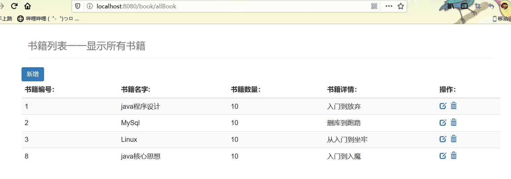
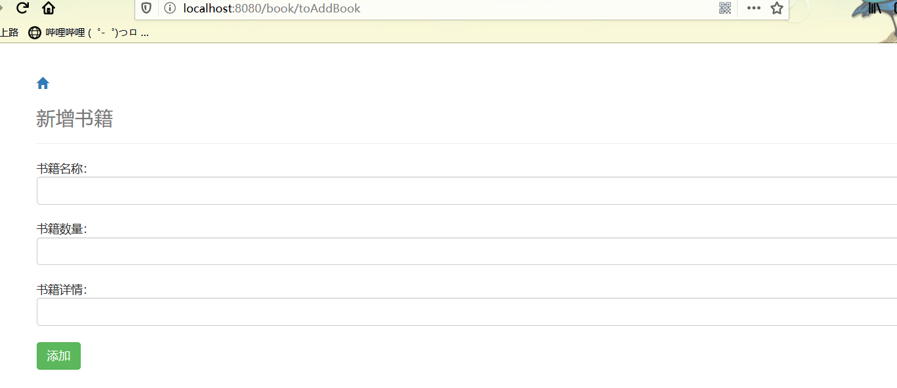
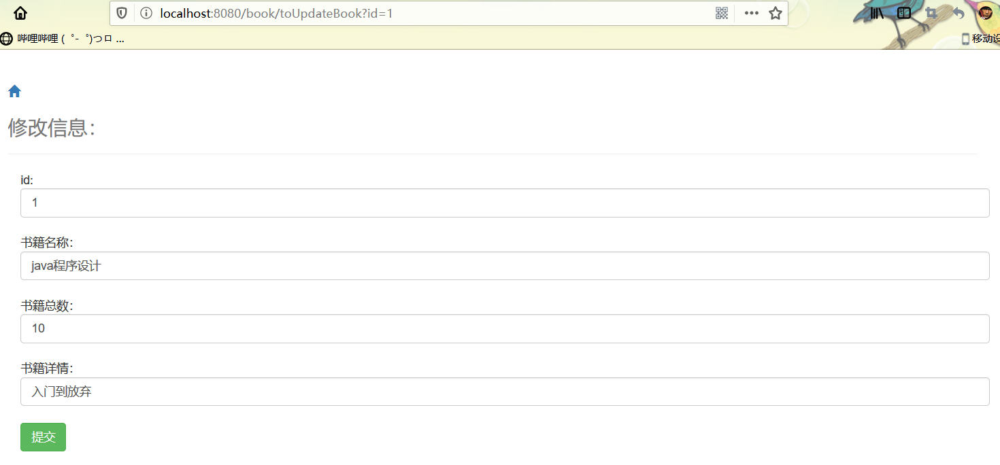
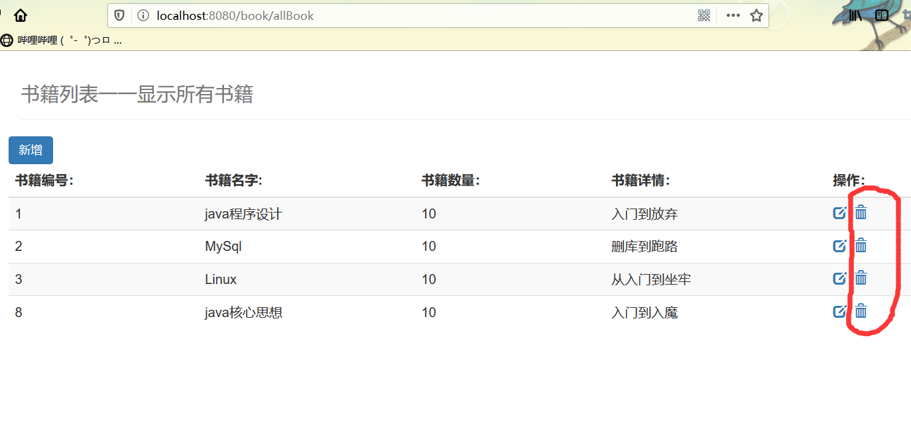
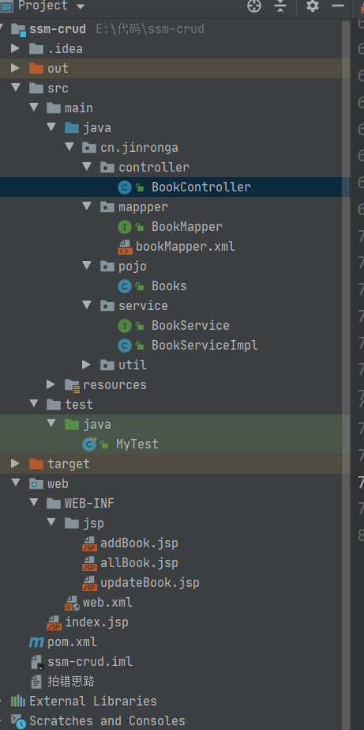

### 整合SSM

---

环境：

- IDEA
- MySQL 5.7.19
- Tomcat 9
- Maven 3.6

 要求：

- 需要熟练掌握MySQL数据库，Spring，JavaWeb及MyBatis知识，简单的前端知识；

##### 数据库环境：

创建一个存放书籍数据的数据库表

```sql
CREATE DATABASE `ssmbuild`;

USE `ssmbuild`;

DROP TABLE IF EXISTS `books`;

CREATE TABLE `books`(
`bookID` INT(10) NOT NULL AUTO_INCREMENT COMMENT '书id',
`bookName` VARCHAR(100) NOT NULL COMMENT '书名',
`bookCounts` INT(10) NOT NULL COMMENT '数量',
`detail` VARCHAR(200) NOT NULL COMMENT '描述',
key `bookID`(`bookID`)
)ENGINE=INNODB DEFAULT CHARSET=utf8


INSERT INTO `books` (`bookID`,`bookName`,`bookCounts`,`detail`)VALUES(1,'java程序设计',10,'入门到放弃'),(2,"MySql",10,"删库到跑路"),(3,"Linux",10,"从入门到坐牢")
```

基本环境搭建

```xml
    <dependencies>
        <!--Junit-->
        <dependency>
            <groupId>junit</groupId>
            <artifactId>junit</artifactId>
            <version>4.12</version>
        </dependency>
        <!--数据库驱动-->
        <dependency>
            <groupId>mysql</groupId>
            <artifactId>mysql-connector-java</artifactId>
            <version>5.1.47</version>
        </dependency>
        <!-- 数据库连接池 -->
        <dependency>
            <groupId>com.mchange</groupId>
            <artifactId>c3p0</artifactId>
            <version>0.9.5.2</version>
        </dependency>

        <!--Servlet - JSP -->
        <dependency>
            <groupId>javax.servlet</groupId>
            <artifactId>servlet-api</artifactId>
            <version>2.5</version>
        </dependency>
        <dependency>
            <groupId>javax.servlet.jsp</groupId>
            <artifactId>jsp-api</artifactId>
            <version>2.2</version>
        </dependency>
        <dependency>
            <groupId>javax.servlet</groupId>
            <artifactId>jstl</artifactId>
            <version>1.2</version>
        </dependency>

        <!--Mybatis-->
        <dependency>
            <groupId>org.mybatis</groupId>
            <artifactId>mybatis</artifactId>
            <version>3.5.2</version>
        </dependency>
        <dependency>
            <groupId>org.mybatis</groupId>
            <artifactId>mybatis-spring</artifactId>
            <version>2.0.2</version>
        </dependency>

        <!--Spring-->
        <dependency>
            <groupId>org.springframework</groupId>
            <artifactId>spring-webmvc</artifactId>
            <version>5.1.9.RELEASE</version>
        </dependency>
        <dependency>
            <groupId>org.springframework</groupId>
            <artifactId>spring-jdbc</artifactId>
            <version>5.2.0.RELEASE</version>
        </dependency>
    </dependencies>
```

3、Maven资源过滤设置

```xml
<build>
   <resources>
       <resource>
           <directory>src/main/java</directory>
           <includes>
               <include>**/*.properties</include>
               <include>**/*.xml</include>
           </includes>
           <filtering>false</filtering>
       </resource>
       <resource>
           <directory>src/main/resources</directory>
           <includes>
               <include>**/*.properties</include>
               <include>**/*.xml</include>
           </includes>
           <filtering>false</filtering>
       </resource>
   </resources>
</build>
```

4、建立基本结构和配置框架！

- cn.jinronga.pojo 你  
- cn.jinronga.mapper
- cn.jinronga.service
- cn.jinronga.controller
- mybatis-config.xml

```xml
<?xml version="1.0" encoding="UTF-8" ?>
<!DOCTYPE configuration
       PUBLIC "-//mybatis.org//DTD Config 3.0//EN"
       "http://mybatis.org/dtd/mybatis-3-config.dtd">
<configuration>

</configuration>
```

- applicationContext.xml

```xml
<?xml version="1.0" encoding="UTF-8"?>
<beans xmlns="http://www.springframework.org/schema/beans"
       xmlns:xsi="http://www.w3.org/2001/XMLSchema-instance"
       xmlns:context="http://www.springframework.org/schema/context"
       xsi:schemaLocation="http://www.springframework.org/schema/beans
   http://www.springframework.org/schema/beans/spring-beans.xsd
   http://www.springframework.org/schema/context
   http://www.springframework.org/schema/context/spring-context.xsd">

</beans>
```

#### Mybatis层编写:

1、数据库配置文件 **database.properties**

```properties
jdbc.driver=com.mysql.jdbc.Driver
jdbc.url=jdbc:mysql://localhost:3306/ssmbuild?useSSL=true&useUnicode=true&characterEncoding=utf8
jdbc.username=root
jdbc.password=123456
```

2、IDEA关联数据库

3、编写MyBatis的核心配置文件

```xml
<?xml version="1.0" encoding="UTF-8" ?>
<!DOCTYPE configuration
       PUBLIC "-//mybatis.org//DTD Config 3.0//EN"
       "http://mybatis.org/dtd/mybatis-3-config.dtd">
<configuration>
   
    <!--    取别名-->
    <typeAliases>
        <package name="cn.jinronga.pojo"/>
    </typeAliases>

    <mappers>
       <mapper resource="cn/jinronga/mappper/bookMapper.xml"/>
    </mappers>

</configuration>
```

Books实体类：

```java
@Data
@AllArgsConstructor//有参构造
@NoArgsConstructor//无参构造
public class Books {

    private int bookID;//书ID
    private String bookName;//书名称
    private int bookCounts;//书的数量
    private String detail;//描述
}
```

BookMapper接口：

```java
public interface BookMapper {
    //增加一本书
    int  addBook (Books books);
   //根据id删除书
    int deleteBook( int id);
    //更新书籍
    int updateBook(Books books);
    //根据id查询书
    Books selectBookbyId(int id);
    //查询所有的书 结果返回一个list集合
    List<Books> selectBooks();
}


```

bookMapper.xml

```xml
<?xml version="1.0" encoding="UTF-8" ?>
<!DOCTYPE mapper
        PUBLIC "-//mybatis.org//DTD Mapper 3.0//EN"
        "http://mybatis.org/dtd/mybatis-3-mapper.dtd">

<mapper namespace="cn.jinronga.mappper.BookMapper">
<!--    增加一本书-->
    <insert id="addBook" parameterType="books">
        INSERT INTO `books`
        (`bookID`,`bookName`,`bookCounts`,`detail`)VALUES
        (#{bookID},#{bookName},#{bookCounts},#{detail})
    </insert>

<!--    通过id删除书籍-->
<delete id="deleteBook" parameterType="int">
    DELETE FROM `books` WHERE `bookID` = #{id}
</delete>

<!--    更新书籍通过id-->
<update id="updateBook" parameterType="books">
    UPDATE `books`
    SET `bookName`=#{bookName},`bookCounts`=#{bookCounts},`detail`=#{detail}
  where  bookID=#{bookID}
</update>

<!--    通过id查询书籍-->
<select id="selectBookbyId" parameterType="int" resultType="books">
SELECT `bookID`,`bookName`,`bookCounts`,`detail`
FROM books WHERE `bookID`=#{id}
</select>

<!--    查询所有的书籍-->
<select id="selectBooks"  resultType="books">
    SELECT `bookID`,`bookName`,`bookCounts`,`detail`  FROM books
</select>
</mapper>
```

##### Service层编写：

7、编写Service层的接口和实现类

接口：

```java
//BookService:底下需要去实现,调用mapper层
public interface BookService {

    //增加一本书
    int  addBook (Books books);
    //根据id删除书
    int deleteBook( int id);
    //更新书籍
    int updateBook(Books books);
    //根据id查询书
    Books selectBookbyId(int id);
    //查询所有的书 结果返回一个list集合
    List<Books> selectBooks();
}
```

实现类：

```java
@Service
public class BookServiceImpl  implements BookService{

    private BookMapper bookMapper;

    //调用mapper 设置set接口 方便Spring进行管理
    public void setBookMapper(BookMapper bookMapper) {
        this.bookMapper = bookMapper;
    }

    //增加
    public int addBook(Books books) {

        return bookMapper.addBook(books);
    }

    //删除
    public int deleteBook(int id) {
        return bookMapper.deleteBook(id);
    }

    //修改
    public int updateBook(Books books) {
        return bookMapper.updateBook(books);
    }

    //通过id查询
    public Books selectBookbyId(int id) {
        return bookMapper.selectBookbyId(id);
    }

    //查询所有
    public List<Books> selectBooks() {
        return bookMapper.selectBooks();
    }
}
```

##### Spring层

1、配置**Spring整合MyBatis**，我们这里数据源使用c3p0连接池；

2、我们去编写Spring整合Mybatis的相关的配置文件

spring-dao.xml

```xml
<?xml version="1.0" encoding="UTF-8"?>
<beans xmlns="http://www.springframework.org/schema/beans"
       xmlns:xsi="http://www.w3.org/2001/XMLSchema-instance"
       xmlns:context="http://www.springframework.org/schema/context"
       xsi:schemaLocation="http://www.springframework.org/schema/beans
       http://www.springframework.org/schema/beans/spring-beans.xsd
       http://www.springframework.org/schema/context
       https://www.springframework.org/schema/context/spring-context.xsd">

    <!-- 配置整合mybatis -->
    <!-- 1.关联数据库文件 -->
    <context:property-placeholder location="classpath:database.properties"/>

    <!-- 2.数据库连接池 -->
    <!--数据库连接池
        dbcp 半自动化操作 不能自动连接
        c3p0 自动化操作（自动的加载配置文件 并且设置到对象里面）
    -->
    <bean id="dataSource" class="com.mchange.v2.c3p0.ComboPooledDataSource">
        <!-- 配置连接池属性 -->
        <property name="driverClass" value="${jdbc.driver}"/>
        <property name="jdbcUrl" value="${jdbc.url}"/>
        <property name="user" value="${jdbc.username}"/>
        <property name="password" value="${jdbc.password}"/>

        <!-- c3p0连接池的私有属性 -->
        <property name="maxPoolSize" value="30"/>
        <property name="minPoolSize" value="10"/>
        <!-- 关闭连接后不自动commit -->
        <property name="autoCommitOnClose" value="false"/>
        <!-- 获取连接超时时间 -->
        <property name="checkoutTimeout" value="10000"/>
        <!-- 当获取连接失败重试次数 -->
        <property name="acquireRetryAttempts" value="2"/>
    </bean>

    <!-- 3.配置SqlSessionFactory对象 -->
    <bean id="sqlSessionFactory" class="org.mybatis.spring.SqlSessionFactoryBean">
        <!-- 注入数据库连接池 -->
        <property name="dataSource" ref="dataSource"/>
        <!-- 配置MyBaties全局配置文件:mybatis-config.xml -->
        <property name="configLocation" value="classpath:mybatis-config.xml"/>
    </bean>

    <!-- 4.配置扫描Dao接口包，动态实现Dao接口注入到spring容器中 -->
    <!--解释 ：https://www.cnblogs.com/jpfss/p/7799806.html-->
    <bean class="org.mybatis.spring.mapper.MapperScannerConfigurer">
        <!-- 注入sqlSessionFactory -->
        <property name="sqlSessionFactoryBeanName" value="sqlSessionFactory"/>
        <!-- 给出需要扫描Dao接口包 -->
        <property name="basePackage" value="cn.jinronga.mappper"/>
    </bean>

</beans>
```

3、**Spring整合service层**

spring-service.xml

```xml
<?xml version="1.0" encoding="UTF-8"?>
<beans xmlns="http://www.springframework.org/schema/beans"
       xmlns:xsi="http://www.w3.org/2001/XMLSchema-instance"
       xmlns:context="http://www.springframework.org/schema/context"
       xsi:schemaLocation="http://www.springframework.org/schema/beans
   http://www.springframework.org/schema/beans/spring-beans.xsd
   http://www.springframework.org/schema/context
   http://www.springframework.org/schema/context/spring-context.xsd">

    <!-- 扫描service相关的bean -->
    <context:component-scan base-package="cn.jinronga.service" />

    <!--BookServiceImpl注入到IOC容器中-->
    <bean id="BookServiceImpl" class="cn.jinronga.service.BookServiceImpl">
        <property name="bookMapper" ref="bookMapper"/>
    </bean>

    <!-- 配置事务管理器 -->
    <bean id="transactionManager" class="org.springframework.jdbc.datasource.DataSourceTransactionManager">
        <!-- 注入数据库连接池 -->
        <property name="dataSource" ref="dataSource" />
    </bean>
</beans>
```

Spring层搞定！

##### SpringMVC层:

1、**web.xml**

```xml
<?xml version="1.0" encoding="UTF-8"?>
<web-app xmlns="http://xmlns.jcp.org/xml/ns/javaee"
         xmlns:xsi="http://www.w3.org/2001/XMLSchema-instance"
         xsi:schemaLocation="http://xmlns.jcp.org/xml/ns/javaee http://xmlns.jcp.org/xml/ns/javaee/web-app_4_0.xsd"
         version="4.0">

    <!--DispatcherServlet-->
    <servlet>
        <servlet-name>DispatcherServlet</servlet-name>
        <servlet-class>org.springframework.web.servlet.DispatcherServlet</servlet-class>
        <init-param>
            <param-name>contextConfigLocation</param-name>
            <!--一定要注意:我们这里加载的是总的配置文件，之前被这里坑了！-->
            <param-value>classpath:applicationContext.xml</param-value>
        </init-param>
        <load-on-startup>1</load-on-startup>
    </servlet>
    <servlet-mapping>
        <servlet-name>DispatcherServlet</servlet-name>
        <url-pattern>/</url-pattern>
    </servlet-mapping>

    <!--encodingFilter-->
    <filter>
        <filter-name>encodingFilter</filter-name>
        <filter-class>
            org.springframework.web.filter.CharacterEncodingFilter
        </filter-class>
        <init-param>
            <param-name>encoding</param-name>
            <param-value>utf-8</param-value>
        </init-param>
    </filter>
    <filter-mapping>
        <filter-name>encodingFilter</filter-name>
        <url-pattern>/*</url-pattern>
    </filter-mapping>

    <!--Session过期时间-->
    <session-config>
        <session-timeout>15</session-timeout>
    </session-config>
</web-app>
```

2、**spring-mvc.xml**

```xml
<?xml version="1.0" encoding="UTF-8"?>
<beans xmlns="http://www.springframework.org/schema/beans"
       xmlns:xsi="http://www.w3.org/2001/XMLSchema-instance"
       xmlns:context="http://www.springframework.org/schema/context"
       xmlns:mvc="http://www.springframework.org/schema/mvc"
       xsi:schemaLocation="http://www.springframework.org/schema/beans
   http://www.springframework.org/schema/beans/spring-beans.xsd
   http://www.springframework.org/schema/context
   http://www.springframework.org/schema/context/spring-context.xsd
   http://www.springframework.org/schema/mvc
   https://www.springframework.org/schema/mvc/spring-mvc.xsd">

    <!-- 配置SpringMVC -->
    <!-- 1.开启SpringMVC注解驱动 -->
    <mvc:annotation-driven />
    <!-- 2.静态资源默认servlet配置-->
    <mvc:default-servlet-handler/>

    <!-- 3.配置jsp 显示ViewResolver视图解析器 -->
    <bean class="org.springframework.web.servlet.view.InternalResourceViewResolver">
        <property name="viewClass" value="org.springframework.web.servlet.view.JstlView" />
        <property name="prefix" value="/WEB-INF/jsp/" />
        <property name="suffix" value=".jsp" />
    </bean>

    <!-- 4.扫描web相关的bean -->
    <context:component-scan base-package="cn.jinronga.controller" />
</beans>
```

3、**Spring配置整合文件，applicationContext.xml**

```xml
<?xml version="1.0" encoding="UTF-8"?>
<beans xmlns="http://www.springframework.org/schema/beans"
       xmlns:xsi="http://www.w3.org/2001/XMLSchema-instance"
       xsi:schemaLocation="http://www.springframework.org/schema/beans
       http://www.springframework.org/schema/beans/spring-beans.xsd">

  <import resource="spring-dao.xml"/>
  <import resource="spring-service.xml"/>
  <import resource="spring-mvc.xml"/>
</beans>
```

**配置文件，暂时结束！Controller 和 视图层编写**

1、BookController 类编写 ，

#####   方法一：查询全部书籍

```java
@Controller
@RequestMapping("/book")
public class BookController {

    @Autowired
    @Qualifier("BookServiceImpl")//指定接口的实现类
    private BookService bookService;

//查询全部书籍
    @RequestMapping("/allBook")
    public String list(Model model){

        List<Books> books = bookService.selectBooks();
        System.out.pr  intln(books);
        model.addAttribute("books",books);

        return "allBook";
    }
}
```

2、编写首页 **index.jsp**

```jsp
<%@ page contentType="text/html;charset=UTF-8" language="java" %>
<html>
  <head>
    <title>首页</title>
    <style>
      a{
        text-decoration: none;
        color: black;
        font-size: 18px;
      }
      h3{
        width: 180px;
        height: 38px;
        margin: 100px auto;
        text-align: center;
        line-height: 38px;
        background: deepskyblue;
        border-radius: 4px;
      }
    </style>
  </head>
  <body>
   <h3>
     <a href="${pageContext.request.contextPath}/book/allBook">
       点击进入首页列表
     </a>
   </h3>
  </body>
</html>

```

3、书籍列表页面 **allbook.jsp**

```jsp
<%@ taglib prefix="c" uri="http://java.sun.com/jsp/jstl/core" %>
<%@ page contentType="text/html;charset=UTF-8" language="java" %>
<html>
<head>
    <title>书籍列表</title>
    <meta name="viewport" content="width=device-width, initial-scale=1.0">
    <!-- 引入 Bootstrap -->
    <link href="https://cdn.bootcss.com/bootstrap/3.3.7/css/bootstrap.min.css" rel="stylesheet">
</head>
<body>

<div class="container">
    <div class="col-md-12 column">
        <div class="page-header">
            <h1>
                <small>书籍列表一一显示所有书籍</small>
            </h1>
        </div>
    </div>


<div class="row">
    <div class="col-md-4 column">
        <a class="btn btn-primary" href="${pageContext.request.contextPath}/book/toAddBook">
            新增
        </a>
    </div>
</div>

<div class="row clearfix">
    <div class="col-md-12 column">
        <table class="table table-hover table-striped">
            <thead>
            <tr>
                <th>书籍编号：</th>
                <th>书籍名字:</th>
                <th>书籍数量：</th>
                <th>书籍详情：</th>
                <th>操作：</th>
            </tr>
            </thead>

            <tbody>
        <c:forEach var="book" items="${requestScope.get('books')}">
         <tr>
             <td>${book.getBookID()}</td>
             <td>${book.getBookName()}</td>
             <td>${book.getBookCounts()}</td>
             <td>${book.getDetail()}</td>
             <td>
                 <a href="${pageContext.request.contextPath}/book/toUpdateBook?id=${book.getBookID()}"><span class="glyphicon glyphicon-edit"></span></a>&nbsp
               <a href="${pageContext.request.contextPath}/book/deleteBook/${book.getBookID()}"><span class="glyphicon glyphicon-trash"></span></a>
             </td>
         </tr>
        </c:forEach>
        </tbody>
        </table>
    </div>
</div>
</div>
</body>
</html>
```

效果：




##### 4、BookController 类编写 ， 方法二：添加书籍

```java
//添加一本书
    @RequestMapping("/addBook")
    public String addBook(Books book){

         bookService.addBook(book);

         //添加完成后回到显示所有的书籍
        return "redirect:/book/allBook";
    }
```

5、添加书籍页面：addBook.jsp

```jsp
<%@ page contentType="text/html;charset=UTF-8" language="java" %>
<html>
<head>
    <title>添加书籍</title>
    <meta name="viewport" content="width=device-width, initial-scale=1.0">
    <!-- 引入 Bootstrap -->
    <link href="https://cdn.bootcss.com/bootstrap/3.3.7/css/bootstrap.min.css" rel="stylesheet">
</head>
<body>
<div class="container">

    <div class="row clearfix">
        <div class="col-md-12 column">
           <div class="page-header">
               <a href="${pageContext.request.contextPath}/book/allBook">
                   <span class="glyphicon glyphicon-home"></span>
               </a>
               <h1><small>新增书籍</small></h1>
           </div>
        </div>
    </div>

    <form action="${pageContext.request.contextPath}/book/addBook" method="post">
        书籍名称：<input class="form-control" type="text" name="bookName"><br>
        书籍数量：<input class="form-control" type="text" name="bookCounts"><br>
        书籍详情：<input class="form-control" type="text" name="detail"><br>
        <input type="submit" value="添加" class="btn btn-success">
    </form>
</div>
</body>
</html>
```

效果：



##### 6、BookController 类编写 ， 方法三：修改书籍

```java
//查询所有书中的修改功能点击后跳到updateBook.jsp
@RequestMapping("/toUpdateBook")
public String toUpdateBook(int id,Model model){
    Books book = bookService.selectBookbyId(id);
    model.addAttribute("book",book);

    return "updateBook";
}
//修改书籍信息
@RequestMapping("/updateBook")
public String updateBook( Books book){

    bookService.updateBook(book);

    return "redirect:/book/allBook";
}
```

7、修改书籍页面  **updateBook.jsp**

```jsp
<%@ page contentType="text/html;charset=UTF-8" language="java" %>
<html>
<head>
    <title>修改信息</title>
    <meta name="viewport" content="width=device-width, initial-scale=1.0">
    <!-- 引入 Bootstrap -->
    <link href="https://cdn.bootcss.com/bootstrap/3.3.7/css/bootstrap.min.css" rel="stylesheet">
</head>
<body>
<div class="container">
    <div class="row clearfix">
        <div class="col-md-12 column">
            <div class="page-header">
                 <span>   <a href="${pageContext.request.contextPath}/book/allBook">
                        <span class="glyphicon glyphicon-home"></span>
                    </a></span>
                <h1><small>修改信息：</small>
                </h1>

            </div>
        </div>
    </div>
    <div class="container">
<form action="${pageContext.request.contextPath}/book/updateBook" method="post">
    id:<input type="text" name="bookID" class="form-control" value="${book.bookID}"><br>
    书籍名称：<input type="text"  name="bookName"  class="form-control" value="${book.bookName}"><br>
   书籍总数： <input type="text" name="bookCounts"class="form-control" value="${book.bookCounts}"><br>
  书籍详情：  <input type="text" name="detail"class="form-control" value="${book.detail}"><br>
      <input type="submit" value="提交" class="btn btn-success">
</form>
</div>
</div>
</body>
</html>
```

效果：



##### 8、BookController 类编写 ， 方法四：删除书籍

```java
@RequestMapping("deleteBook/{bookId}")
public String deleteBook(@PathVariable("bookId") int id){
  bookService.deleteBook(id);

    return "redirect:/book/allBook";
}
```



配置Tomcat，进行运行！**

到目前为止，这个SSM项目整合已经完全的OK了，可以直接运行进行测试！

结构目录：



BooMapper.java

```java
 //查询指定的书籍
    Books selectBookName(@Param("bookName")String bookName);
```

booMapper.xml

```xml
<!--    根据指定的名字搜索书籍-->
    <select id="selectBookName"  resultType="books">
SELECT `bookID`,`bookName`,`bookCounts`,`detail`
FROM books where `bookName` =#{bookName}
    </select>
```

控制器：

```java

    @RequestMapping("/bookName")
    public String selectBookName( String bookName,Model model){

        
        Books book = bookService.selectBookName(bookName);


        List<Books> books=new ArrayList<Books>();
        if (book==null){

            model.addAttribute("err","没有查询到！");
        }
        books.add(book);
        model.addAttribute("books",books);

        return  "allBook";
    }
```

allBook.jsp

```jsp
    <div class="col-md-8 column">
        <span class="bg-danger">${err}</span>
        <form action="${pageContext.request.contextPath}/book/bookName" method="post" style="float: right" class="form-inline">
            <input  class="form-control" type="text" name="bookName" placeholder="请输入你要搜索的书籍">
            <input type="submit" value="搜索" class="btn btn-primary">
        </form>
    </div>
</div>
```

