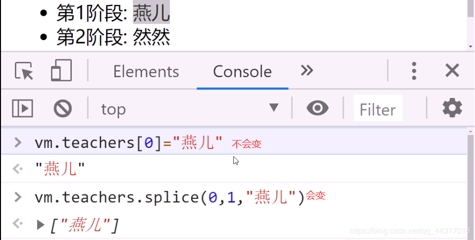
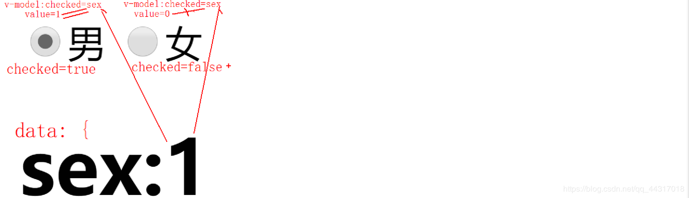
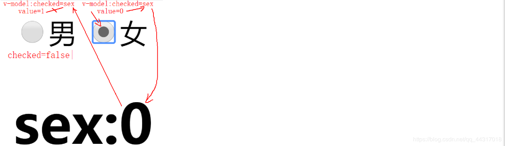
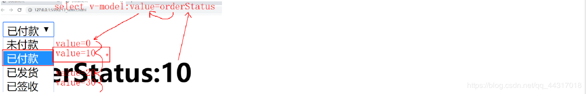
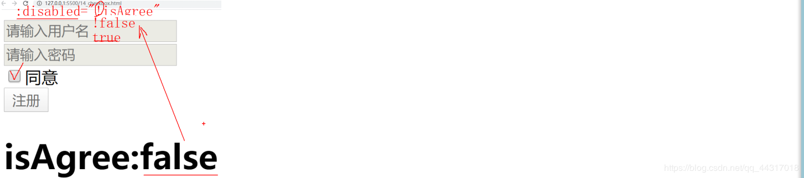
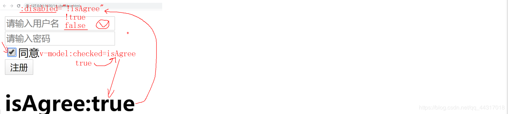
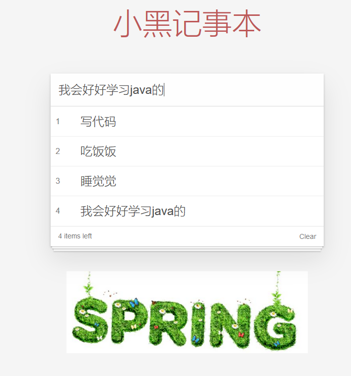

### 初识vue

---

#### 什么是Vue

1.什么是vue: 

基于MVVM设计模式的渐进式的纯前端js框架
(1). MVVM?
(2). 渐进式: 不要求整个项目都用vue做，可以轻松和别的技术混搭，且会多少就可以先用多少！
(3). 纯前端js框架: 与nodejs无关！单靠浏览器就可运行！
(4). 框架:
a. 原生js: 不需要下载，浏览器就自带的ES+DOM+BOM
1). 优点: 万能！
2). 缺点: 繁琐！
b. jQuery函数库: 基于原生js，重新封装的一批函数的集合。简化了传统DOM每一步操作！
1). 优点: 简单！
2). 缺点: 没有简化开发的步骤！依然包含大量重复的编码！
c. 框架: 已经包含核心功能的半成品项目！

 **优点:** 根本上简化了开发流程，几乎避免了重复编码
 **缺点:** 需要转变观念，和做事方法！很难适应！

2.为什么: 便于大项目的开发，避免重复代码，提高开发效率

3.凡是以数据为主(增删改查)的项目，都可用vue开发！

##### 如何使用Vue

**1.下载:**

(1). 下载vue.js文件，引入普通网页中使用:

   <script src="https://cdn.jsdelivr.net/npm/vue/dist/vue.js"></script> —— 初学者

版本: 2.6
 开发版: 未压缩版: 包括完备的注释，代码格式和见名知义的变量名，同时带有非常人性化的错误提示。
 生产版: 压缩版: 去掉了注释，代码格式，极简化了变量名，同时删除了错误提示！
 (2). 使用脚手架代码: —— 公司中

第一个程序：

```vue
<div id="app">
  {{ message }}
</div>

var app = new Vue({
  el: '#app',
  data: {
    message: 'Hello Vue!'
  }
})
```

2.我的第一个vue功能: 示例：单击按钮改变数量:

**jQuery版本：**

```javascript
<head>
<meta charset="UTF-8">
<meta name="viewport" content="width=device-width, initial-scale=1.0">
<meta http-equiv="X-UA-Compatible" content="ie=edge">
<title>Document</title>
<script src="js/jquery-1.11.3.js"></script>
</head>
<body>
<button id="btnMinus">-</button><span >0</span><button id="btnAdd">+</button>
<script>
//DOM4步
//1. 查找出发事件的元素
//本例中: 先点击+按钮
$("#btnAdd")
//2. 绑定事件处理函数
.click(function(){
  //3. 查找要修改的元素
  //本例中查找当前按钮兄弟中的span元素
  var $span=$(this).siblings("span")
  //4. 修改元素
  //获取span的内容，转为整数
  var n=parseInt($span.html());
  //n+1
  n++;
  //再放回去
  $span.html(n);
})

//1. 查找出发事件的元素
//本例中: 先点击+按钮
$("#btnMinus")
//2. 绑定事件处理函数
.click(function(){
  //3. 查找要修改的元素
  //本例中查找当前按钮兄弟中的span元素
  var $span=$(this).siblings("span")
  //4. 修改元素
  //获取span的内容，转为整数
  var n=parseInt($span.html());
  //只有n>0时，才能-1
  n>0&&(n--);
  //再放回去
  $span.html(n);
})
</script>
</body>
```

**Vue版本:**

```vue
<!DOCTYPE html>
<html lang="en">
<head>
    <meta charset="UTF-8">
    <meta name="viewport" content="width=device-width, initial-scale=1.0">
    <title>vue</title>

    <script src="https://cdn.jsdelivr.net/npm/vue/dist/vue.js"></script>
</head>
<body>
    <!--1. 做界面: 
  1.1 要求:只能有一个唯一的父元素
  1.2 用{{变量}}语法在HTML中标记出可能变化的位置——类似于模板字符串中的${变量}
  本例中: 只有span的内容可能会变
  1.3 用@事件名="函数名",为元素绑定事件
-->
<div id="app">
    <button @click="minus">-</button>
    <span>{{n}}</span>
    <button @click="add">+</button>
</div>
<script>
 //2. 定义一个对象，其中保存页面上所需的所有变量
//data中的变量名应该和html中的{{}}里的变量名保持一致
//通常HTML中有几个{{变量}}，data中就要有几个属性支持页面上的变量
//本例中: HTML中只需要一个变量n
//一个功能的所有变量都要写在data对象内！

var data={n:0}
var app=new Vue({
    el: '#app',//找到HTML中id为app的选择器
    data:data,//将保存数据的data对象包含进new Vue里边来！
    //{ n:0 } 就成了vue的成员
  //所有页面上需要的事件处理函数都要写在methods的成员中:
    methods:{
        //本例中: 页面上需要两个函数: add和minus
    //在事件处理函数中，只需要埋头专心处理数据即可！new Vue()会自动保持变量和页面内容同步！
    //且在methods的方法中，可用this.访问当前对象自己data中的变量
        add:function(){
             //this->当前new Vue()对象！
            this.n++;
        },
        minus:function(){
        this.n--;
        }
    }
})
</script>
</body>
</html>
```

计数器：

n小于0就不能再点并且n大于10也不能再点

```vue
 <div id="app">
        <button  @click="minus">-</button>
        <span>{{n}}</span>
        <button @click="add">+</button>
    </div>
    
   <script>
       var data={n:1};
        var app=new Vue({
            el:'#app',
            data:data,
            methods:{
                minus:function(){
                    if(this.n>0){
                        this.n--;
                    }else{
                        alert("别点了小于0了");
                    }
                
                },
                add:function(){
                    if(this.n<10){
                        this.n++;
                    }else{
                        alert("别点了大于10了");
                    }
                }
            }
        })
   </script>
```

##### MVVM设计模式

1.什么是: 对前端三大部分代码的重新划分
2.旧划分:
(1). HTML 专门定义网页内容的语言
(2). CSS专门定义网页样式的的语言
(3). Js专门操作页面内容和样式，添加交互行为的语言

3.问题: 因为HTML和CSS很弱！缺少编程语言必须的要素！
(1). 没有变量，如果想让内容虽程序自动改变，不可能！
(2). 缺少必要的程序结构: 没有分支和循环
导致: JS要承担一切操作页面的代码！导致JS代码繁琐，且重复代码极多！

4.新划分:
(1). 界面/视图(View):
a. 包括传统的HTML+CSS
b. 增强了HTML的功能！
1). 比如: HTML中可以写变量！
2). HTML中可以写if else if else 也可以写for循环
3). HTML中可以写事件绑定！
(2). 模型数据(Model): 页面上所有需要的变量，集中保存在一个对象中！
问题: 模型数据中的变量值，不会自动跑到页面上指定位置的！
(3). **视图模型(ViewModel): 用一个对象将视图(View)和模型对象(Model)绑定起来！**
**绑定结果: 数据模型中的变量值，可以自动跑到视图中指定位置，无需任何js编码！且模型对象中数据改变，视图中对应位置的变量值跟着自动变化！**

5.MVVM的原理: Vue框架是如何实现MVVM设计模式的
(1). new Vue()加载data对象
a. 将data对象打散，data内部的属性直接隶属于new Vue()对象
b. 将data中每个原始属性隐姓埋名，隐藏
c. 为data中每个属性请保镖:
1). Data中每个属性都有一对儿get/set方法
2). 今后只要想修改data中的变量都会自动触发set()
3). 在每个属性的set方法中，都自动植入一个notify()函数调用，只要试图修改data中的属性值时，都会自动调用set(),只要自动调用set()势必会自动notify()发出通知
(2). 加载虚拟DOM树:
a. 通过el属性值的选择器找到要监控区域的父元素
b. 创建虚拟DOM树
c. 扫描这个要监控的区域:
1). 每发现一个{{变量}}的元素，就将该元素的信息，记录进虚拟DOM树，同时首次用data中同名变量的值，代替页面中{{n}}的位置。
2). 每发现一个@事件名="函数名"的元素，就自动变为:
On事件名=“new Vue().函数名”
(3). 加载methods对象: methods对象中的所有方法，都会被打散，直接隶属于new Vue()和data中被打散的属性平级
所以，在methods中的方法中，想操作data中的属性，都可以写为"this.属性名"即可！
(4). 当触发事件时，自动调用new Vue()中methods中指定的函数，执行其中this.属性名的修改。修改会自动触发属性的set()方法，自动触发set()内部的notify函数:
a. 遍历虚拟DOM树，只找出受影响的个别元素
b. 利用虚拟DOM树提前封装好的DOM操作，只修改页面中受影响的个别元素！——效率高！
6.总结: MVVM的原理/Vue的绑定原理:
**访问器属性+观察者模式+虚拟DOM树**

7.什么是虚拟DOM树:
(1). 什么是虚拟DOM树: 仅保存可能发生变化的少量元素的精简版DOM树
(2). 优点:
a. 小, 遍历快！
b. 只更新受影响的元素，效率高！
c. 封装了DOM操作，无需我们程序员重复编码！

##### 绑定语法: 同模板字符串中的${}

插值语法: Interpolation

什么是绑定语法: 让HTML中的内容也可随程序中的变量改变而自动改变！——也就是给HTML中添加变量功能
何时: 只要元素的内容中想随变量自动改变
如何: <元素>xxxx{{变量名}}xxxx</元素>
原理:
(1). 首次加载页面内容时，会用data中同名变量的初始值代替{{变量名}}位置
(2). 当data中同名变量在new Vue()中被更改时，自动更新{{变量名}}位置为新值
总结: {{}}中可以放什么，不能放什么
(1). 可以放: 变量，表达式，函数调用，创建对象，访问数组元素，三目
(2). 不能放: 程序结构(分支和循环)，没有返回值的函数调用

6.示例: 使用vue在页面上显示不同内容

```vue
<!DOCTYPE html>
<html lang="en">
<head>
    <meta charset="UTF-8">
    <meta name="viewport" content="width=device-width, initial-scale=1.0">
    <title>Document</title>
    <script src="https://cdn.jsdelivr.net/npm/vue/dist/vue.js"></script>

</head>
<body>
     <div id="app">
         <h1>用户名：{{uname}}</h1>
         <h2>性别：{{sex==1?"男":"女"}}</h2>
         <h3>下单时间:{{new Date(orderTime).toLocaleString()}}</h3>
  <h3>小计:¥{{(price*count).toFixed(2)}}</h3>
     </div>
    <script >

var vm =new Vue({
        el:'#app',
       data:{
           uname:"dingding",
           sex:1,
           orderTime:1579507293225,
           price:12.5,
           count:5
    //将来这些值都来自于ajax请求
       }
    })
    </script>
   </body>
</html>
```

##### 指令(directive)

1. 什么是: 为HTML元素添加新功能的特殊属性
2. 何时: 只要HTML元素需要某些特殊的功能时，就要使用对应的指令来实现
3. 包括: 13种

##### vue中的键盘事件：

获取按键的键码 e.keyCode

@keyup.13   按回车键

@keyup.enter 回车

@keyup.up   上键

@keyup.down  下键

@keyup.left   左键

@keyup.right   右键

@keyup.delete   删除键

##### v-bind

4.如果元素的属性值希望动态改变:
(1). 问题: 不能用{{}}绑定
(2). 解决: 应该用v-bind指令：
a. 标准写法: <元素 v-bind:属性名=“js表达式”>
b. 强调: 一定不要加{{}}，属性名前加v-bind:，=后的"“就扮演了{{}}的角色！{{}}中能写什么，此时”"中就能写什么！
c. 简写: 其实v-bind可省略！但是:不能省略！<元素:属性名="js表达式">
(3). 示例: 根据不同的变量值，动态改变

```vue
<head>
  <meta charset="UTF-8">
  <meta name="viewport" content="width=device-width, initial-scale=1.0">
  <meta http-equiv="X-UA-Compatible" content="ie=edge">
  <title>Document</title>
  <script src="js/vue.js"></script>
</head>
<body>
<div id="app">
<!--希望img的src属性，随变量PM25的值变化
  如果pm25<100, src变为1.png
  否则如果pm25<200, src变为2.png
  否则如果pm25<300, src变为3.png
  否则src变为4.png-->

<h1>{{pm25<100?'img/1.png':
      pm25<200?'img/2.png':
      pm25<300?'img/3.png':
               'img/4.png'}}</h1>
</div>
<script>
var vm=new Vue({
  el:"#app",
  data:{
    //本例中: 因为页面上只需要一个变量pm25，所以data中只有一个变量pm25
    pm25:125
  }
})
setInterval(function(){
  vm.pm25=Math.random()*400
},1000)
</script>
</body>
```


##### v-show

a. 如何: <元素 v-show="js条件">
b. 原理: new Vue()扫描到v-show时，自动执行js条件，如果条件为true，则该元素原样显示。否则如果js条件执行结果为false，则new Vue()自动为当前元素加display:none，隐藏
c. 示例: 点按钮控制对话框显示和隐藏

```vue

    <style>
        .alert{
          width:300px;
          height:100px;
          position:fixed;
          padding:10px;
          top:50%;
          left:50%;
          margin-left:-160px;
          margin-top:-60px;
          background-color:#faf
        }
        .alert>span{
          cursor:pointer;
          border:1px solid #fff;
          float:right;
          padding:5px;
        }
      </style>
    <script src="https://cdn.jsdelivr.net/npm/vue/dist/vue.js"></script>

</head>
<body>
    <div id="app">
        <!--希望单击按钮时，让对话框显示-->
        <button @click="showIt">click me</button>
        <div v-show="show" class="alert">
          <!--希望点x时，关闭对话框-->
          <span @click="close">x</span>
          点x关闭窗口
        </div>
      </div>

    <script>

        var app=new Vue({
            el:"#app",
            data:{
                show:false
            },
            methods:{
    //因为页面上单击按钮需要调用名为showIt的函数，所以
    //showIt:function(){
    showIt(){
      //本例中: 调用showIt为了让对话框显示！
      //所以: 
      this.show=true;
    },
    //因为页面上单击x按钮需要调用名为close的函数，所以
    close(){
      //本例中: 调用close为了关闭对话框
      this.show=false;
    }
  }
        })
    </script>
```

v-show显示图片与隐藏图片：

```vue
    <div id="app">
        <button @click="changIsShow">显示图片</button>
        <button @click="noIsShow">隐藏图片</button>
        
    </div>

    <script>
      var app=new Vue({
          el:"#app",
          data:{
              isShow:false,
              age:17
          },
          methods:{
          //显示图片
          changIsShow:function(){
               this.isShow=true;
          },
          //隐藏图片
          noIsShow:function(){
           this.isShow=false;   
          }

          }
      })
    </script>
```

###### v-if

a. 也能控制一个元素显示隐藏，上例中v-show可直接换成v-if。
b. 但是原理不同：v-if在扫描时，如果条件为true，则保留该元素。否则如果条件为false，则删除该元素！
鄙视: v-show vs v-if
v-show 采用display:none方式隐藏元素，不改变DOM树，效率高！
v-if 采用添加删除元素方式控制元素显示隐藏，可能频繁修改DOM树，效率低！
5. 控制两个元素二选一显示隐藏:
    (1). <元素1 v-if=“条件”>
    <元素2 v-else>
    (2). 强调:
    a. v-else后不要写条件！(同js程序中的else)
    b. v-if 和 v-else之间必须连着写，不能插入任何其他元素
    (3). 原理: 如果扫描到v-if时，自动执行条件。如果条件为true，则保留v-if元素，删除v-else元素。否则如果条件为false，则删除v-if元素，保留v-else元素
    (4). 示例: 切换登录和注销状态

  ```vue
  <div id="app">
  <!--希望如果已经登录，显示第一个div
      如果点注销，希望状态改为未登录-->
  <div v-if="isLogin" id="div1">
    Welcome dingding | <a href="javascript:;" @click="logout">注销</a>
  </div>
  <!--否则如果未登录时，显示第二个div
      如果点登录，则状态改为已登录-->
  <div v-else id="div2">
    <a href="javascript:;" @click="login">登录</a> | <a href="javascript:;">注册</a>
  </div>
  
  <script>
  var vm=new Vue({
    el:"#app",
    data:{
      //因为界面上需要一个变量isLogin来表示是否登录
      isLogin:false
    },
    methods:{
      //因为页面上单击登录，需要调用login函数
      login(){
        //点击登录，修改状态为已登录
        this.isLogin=true;
      },
      //因为页面上单击注销，需要调用logout函数
      logout(){
        //点击注销，修改状态为未登录
        this.isLogin=false;
      }
    }
  })
  </script>
  ```

  ##### 图片切换

  图片切换上一张下一张建议使用v-show提高效率：

  ```vue
  <div id="app">
        <!-- 上一张下一站链接一定要放在图片上面，不然没效果 -->
      <a href="javascript:void(0)" @click="pred" v-show="index!=0" class="left">上一张</a>
      <a href="javascript:void(0)" @click="next"v-show="index<10" class="right">下一张</a>
         
      </div>
      <script>
          var app=new Vue({
              el:'#app',
              data:{
                  //图片数组
                imgs:[
               " img/3.jpg",
               "img/4.jpg",
                "img/5.jpg",
                "img/周.png",
                ],
                //数组索引
                index:1
              },
              methods:{
                pred:function(){
           
                    this.index--;
                },
                next:function(){
        
                    this.index++;
                }
              }
          })
      </script>
  ```

#####   v-for

反复生成多个相同结构的HTML元素: v-for
(1). <要反复生成的元素 v-for="(value, i) of 数组">
强调: v-for一定要放在那个要反复生成的元素上，而不是放在父元素上！
(2). 原理:
a. 当new Vue()扫描到这里时，自动遍历of后的数组中每个元素
b. 每遍历一个元素，就创建一个当前HTML 元素的副本
c. of前的两个变量:
1). value会自动获得当前正在遍历的数组元素值
2). i 会自动获得当前正在遍历的下标位置
d. 如果当前元素或子元素中，需要使用当前正在遍历的元素值或下标，可用绑定语法来绑定value和i的值。
强调: value和i的使用范围仅限于当前元素及其子元素范围内，不能在当前元素外使用！
(3). 示例: 遍历数组元素，反复生成多个相同结构的元素

```	vue
<div id="app">
        <button @click="app">增加</button>
        <button @click="remove">减少</button>
        <ul>
            <li v-for="(name,index) in arr">{{index+1}}城市：{{name}}</li>
        </ul>    

        <h2 v-for="item in vagetables ">
          {{item.name}}        
        </h2>
    </div>
  

    <script>
        var app=new Vue({
             el:'#app',
             data:{
                arr:["北京","上海","深圳","广州"],
                vagetables:[
                    {name:"我会好好学习java的"},
                    {name:"我会好好学python的"},
    
                ]
             },
             methods:{
           app:function(){
               this.vagetables.push({name:"我会好好学习java"});
           },
           remove:function(){
               this.vagetables.shift();
           }
             }
        })
    </script>
```

v-for还可:
 a. 可遍历数字下标的一切: 比如字符串
 b. 可遍历对象中每个属性
 示例: 遍历对象中每个属性，反复生成多个html元素

```vue
<div id="app">
  <!--希望遍历data中一个对象的每个属性，反复生成多个相同结构的HTML元素-->
  <ul>
    <li v-for="(value,key) of ym" :key ="key">{{key}} : {{value}}</li>
  </ul>
</div>
<script>
var vm=new Vue({
  el:"#app",
  data:{
    ym:{
      math:89,
      chs:69,
      eng:91
    }
  }
})
</script>
```

**splice**

(5) 坑: 如果v-for遍历的是数组时，在程序中通过下标修改数组元素值，页面上的HTML元素不会自动更改！
比如: this.teachers[0]="燕儿" 页面上是不会变的！
因为数组中的数字类型的下标012…无法添加访问器属性，也就不受监控！
解决: 今后，vue中修改数组中的元素值！必须用数组家函数！才能自动更新页面。因为函数都是受监控的。
比如: this.teachers.splice(0,1,"燕儿")
删除0位置的1个元素，再在0位置放入"燕儿"
结果: 页面会自动变化！



(6). 其实每次使用v-for时，都要同时绑定:key=“i”
:key=“i”

BS: 为什么v-for必须加:key
答: 因为v-for反复生成的多个元素，除了内容不同之外，从元素属性上来看多个元素毫无差别！每个反复生成的元素都是一样的。所以，如果将来修改了数组中一个元素时，v-for因为无法识别每个HTML元素，所以只能把所有的HTML元素重新生成一遍——效率低！
如果给每个元素都绑定:key="i"属性，则每个HTML元素上都有一个唯一的标识key=“0” key=“1” … 。当将来修改了数组中每个位置的元素时，只需要修改对应key的HTML元素即可，其他HTML元素保持不变！——效率高！
总结: 避免修改数组元素时，重新生成所有HTML元素，而是只更新其中一个HTML元素即可！提高修改效率！
如何:
1). 当遍历数组时: <元素 v-for="(val,i) of 数组" :key="i"
Key的值依次是0 1 2 3…
2). 当遍历对象时: <元素 v-for="(val,key) of 对象" :key="key"
Key的值依次是: 属性名1 属性名2 …
因为一个对象内的属性名肯定不会重复，所以，属性名也可以当做:key唯一标识一个HTML元素

##### v-on

a. v-on: 可用@简写
 <元素 @事件名=“处理函数()”
 b. 如果处理函数不需要传参，()可省略
 <元素 @事件名=“处理函数”

 ```vue
<div id="app">
        <button @click="doIt('你好')">点击</button>
        <!-- 键盘事件，键盘回车执行函数 -->
        <input type="text" @keyup.enter="sayHi">
    </div>


 
    <script>
     var app=new Vue({
         el:'#app',
        methods:{
            doIt:function(p1){
                console.log("做it");
                console.log(p1);
            },
            sayHi:function(){
                alert("好滴好滴");
            }
        }
     })
    </script>
 ```

###### v-html

(1). 问题: {{}}不能绑定HTML片段内容。
因为: {{}}本质相当于DOM中的textContent，会将HTML内容原样显示，不会被编译！
(2). 解决: 今后只要要绑定的变量内容是一段HTML片段时，都用v-html来绑定！
(3). 如何:<元素 v-html="包含HTML内容的变量或表达式">
(4). 强调:
a. v-html会将绑定内容中的HTML内容，编译后再显示给人看
b. v-html也是指令，所以v-html后的""中可以写js表达式，比如字符串拼接！
c. 用了v-html，就不要再元素开始标签和结束标签直接写内容！因为会被v-html内容替换！
(5). 示例: 绑定HTML内容

```vue
    <div id="app">
        <h1>消息来源:{{html}}</h1>
        <h1 v-html="'消息来源:'+html">
          Welcome
        </h1>
      </div>
      <script>
      var vm=new Vue({
        el:"#app",
        data:{
          html:`<p>来自<a href="javascript:;">&lt;&lt;新华社&gt;&gt;</a>的消息</p>`
        }
      })
      </script>
```

###### 防止用户短暂看到{{}}

问题: 因为vue代码是放在js文件中，所以，如果网速慢，vue代码暂时没有下载下来时，用户很可能短暂看到页面上的绑定语法，用户体验不好！
 解决: 2个办法:

###### v-cloak

(1). 用v-cloak暂时隐藏带有{{}}内容的元素:
a. 2步:
1). 在包含绑定语法{{}}的元素上添加v-cloak属性
2). 在css中手动添加样式: [v-cloak]{ display:none }
b. 原理：
1). 用属性选择器查找所有带有v-cloak属性的元素，暂时隐藏
2). 当new Vue()渲染完成时，自动找到所有v-cloak属性，自动移除。
c. 示例: 使用v-cloak防止用户短暂看到{{}}

```vue
<head>
  <meta charset="UTF-8">
  <meta name="viewport" content="width=device-width, initial-scale=1.0">
  <meta http-equiv="X-UA-Compatible" content="ie=edge">
  <title>Document</title>
  <style>
  [v-cloak]{
    display:none
  }
  </style>
  <script src="js/vue.js"></script>
</head>
<body>
<div id="app">
  <h1 v-cloak>Welcome: {{uname}}</h1>
</div>
<script>
setTimeout(function(){
  var vm=new Vue({
    el:"#app",
    data:{
      uname:"dingding"
    }
  })
},2000)
</script>
</body>
```

d. 问题: 既要在HTML中写指令，又要手动添加css选择器，步骤繁琐的！

###### v-text

(2). 用v-text代替内容中{{}}语法，来绑定非HTML片段内容:
a. <元素 v-text=“原{{}}内容”></元素>
b. 原理:
1). 因为绑定语法写在了元素的属性里，所以，如果不是vue帮忙，用户无论如何是看不到元素属性中的内容的！
2). New Vue()读取到v-text时，会解析v-text的内容，替换元素开始标签和结束标签之间的内容
c. 强调:
1). 和v-html不同，v-text等效于{{}}等效于DOM中的textContent，所以如果v-text中包含HTML片段，是不会被编译，而是原样显示给人看！
2). v-text也是指令，所以v-text后的""中也可以写js表达式，比如字符串拼接！
3). 用了v-text，也不要在元素开始标签和结束标签直接写内容！因为会被v-text内容替换！
d. 示例: 使用v-text防止用户短暂看到{{}}

```vue
<div id="app">
  <h1 v-text="'Welcome:'+uname"></h1>
</div>
<script>
setTimeout(function(){
  var vm=new Vue({
    el:"#app",
    data:{
      uname:"dingding"
    }
  })
},2000)
</script>
```

##### $event

BS: 如果既想传入自定义实参值，又想获得事件对象:
i. 借助 $ event关键字: vue框架内部内置的专门指向事件对象的关键词。用 $ event等效于用事件对象e
ii. 调用函数时，可将 $ event和其他实参值一起传入函数中
iii. 定义函数时，可用普通的形参变量接住 $ event的值。
iv. 示例: 使用 $event获得鼠标位置并传入自定义实参值

```vue
<head>
  <meta charset="UTF-8">
  <meta name="viewport" content="width=device-width, initial-scale=1.0">
  <meta http-equiv="X-UA-Compatible" content="ie=edge">
  <title>Document</title>
  <style>
  div{
    width:300px; height:100px;
    margin:20px;
  }
  #d1{
    background-color:#aaf
  }
  #d2{
    background-color:#ffa
  }
  </style>
  <script src="js/vue.js"></script>
</head>
<body>
<div id="app">
<div id="d1" @click="doit('d1',$event)">d1</div>
<div id="d2" @click="doit('d2',$event)">d2</div>
</div>
<script>
var vm=new Vue({
  el:"#app",
  data:{
    
  },
  methods:{
    doit(name,e){//同DOM的e
      console.log(`点在${name}的: x:${e.offsetX},y:${e.offsetY}`);
    }
  }
})
</script>
</body>
```

###### v-once

仅在首次渲染页面时绑定一次，即使之后模型变量再改变，也不会自动更新页面: `<元素 v-once>`
 示例: 显示时间

###### v-pre

防止元素内容中的{{}}被vue编译，让内容中的{{}}原样显示！
<元素 v-pre> xxx{{xx}}xxx </元素>
双向绑定

1. 单向绑定: 只能将data中的变量值，自动同步更新到HTML页面中。但是，页面上的修改，无法自动更新回data的变量中。(前面的11种都是)
   (data —> div#app 但是 div#app -x-> data)

2.双向绑定: 既能将data中的变量值，自动同步更新到HTML页面中。又能将页面上的修改自动更新回data的变量中。
(data <===> div#app)
3.何时使用双向绑定: **只有绑定表单元素时，才有必要用双向绑定！因为只有表单元素，用户才能在页面上修改的它的内容。**

###### v-model

如何: 每种表单元素绑定的原理不同:
1). 文本框/文本域: 绑定的是value属性
a. <input v-model:value="变量"/> / <textarea v-model:value="变量"></textarea>
b. 原理: new Vue()扫描到这里时，自动为当前元素绑定事件，比如，如果<input type="text" v-model:value="变量">，就会翻译为: οninput=“vm.变量=当前文本框的新value”。
c. 示例: 点按钮，按回车，在文本框中输入内容，都可获得文本框中输入的关键词，执行搜索操作。

```vue
    <div id="app">
        <!--在文本框上按回车可以查找-->
        <input type="text" v-model:value="keywords" @keyup="myKeyUp">
        <!--点击按钮可以查找-->
        <button @click="search">百度一下</button>
      </div>
      <script>
      var vm=new Vue({
        el:"#app",
        data:{
          keywords:"macbook i5"
        },
        methods:{
          search(){
            console.log(`查找 ${this.keywords} 相关的内容...`)
          },
             // $event
             //   ↓
          myKeyUp(e){
            //只有按回车才查找
            if(e.keyCode==13){
              //调用旁边的search()函数
              this.search();
            }
          }
        },
        //想变量keywords只要被更改，就重新执行一次搜索
        watch:{
          keywords(){
            console.log("自动调用一次watch中的keywords函数...")
            this.search();
          }
        }//进入new Vue()中的一切data:{}, methods:{}, watch:{}都会被打散，最终都直接隶属于new VUe()对象，都是平级的，所以可以this.方式，互访。
      })
      </script>
```

(2). 单选按钮: **绑定的是checked属性**

a. <input type="radio" name="sex" value="1" v-model:checked="变量">男
<input type="radio" name="sex" value="0" v-model:checked="变量">女
b. 原理:
(1). 从data->input: 用checked绑定的变量的值和当前radio的value做比较。如果checked绑定的值和value值相等，则当前radio选中。否则不选中。



(2). 切换选中一个radio后，用当前选中的radio的value值代替checked属性绑定的data中的变量值。导致，页面中其它关注这个变量的位置都自动发生改变。



示例: 选择性别

```vue
<div id="app">
<label><input type="radio" name="sex" value="1" v-model:checked="sex">男</label>
<label><input type="radio" name="sex" value="0" v-model:checked="sex">女</label>
<h1>sex:{{sex}}</h1>
</div>
<script>
var vm=new Vue({
  el:"#app",
  data:{
    sex:1
  }
})
</script>
```

(3). 双向绑定select元素: 因为改变select的选中项，改变的是中整个select的value值，所以应该绑定select元素的value
 a.

```javascript
<select v-model:value="变量">
		<option value="值1">文本1</option>
		<option value="值2">文本2</option>
```

b. 原理:
 1). 从data->select:用value绑定变量值，和每个option的value做比较，哪个option的value等于变量值，就选中哪个option



2). 切换select中的选中项: 用新选中的option的value值替换select的value绑定的data中的变量值。导致所有关系这个变量的其它位置自动变化。 

```vue
 <div id="app">
        <select v-model:value="orderStatus">
            <option value="0">未付款</option>
            <option value="10">已付款</option>
            <option value="20">已发货</option>
            <option value="30">已签收</option>
        </select>
        <h1>orderStatus:{{orderStatus}}</h1>
    </div>
    
    <script>
        var app=new Vue({
            el:'#app',
            data:{
    //0:未付款  10:已付款  20:已发货 30:已签收
                orderStatus:10
            }
        })
    </script>
```

(4). 双向绑定一个checkbox的情况: 因为选中或取消选中checkbox改变的它的checked属性，所有v-model应该绑定checked属性。且绑定的变量应该是bool类型
a. <input type="checkbox" v-model:checked="变量">
b. 原理:
1). 从data->input checkbox: 根据变量是true还是false，设置当前checkbox是否选中
2). 当切换checkbox的选中状态后，就用新的checked属性值(true或false)，更新到绑定的data中的变量中
c. 示例: 同意，启用表单元素，不同意，则禁用表单元素





```vue
    <div id="app">
        <input type="text" placeholder="请输入用户名" :disabled="!isAgree"><br/>
        <input type="password" placeholder="请输入密码" :disabled="!isAgree"><br/>
        <label><input type="checkbox" v-model:checked="isAgree">同意</label></br>
        <button :disabled="!isAgree">注册</button>
        <h1>isAgree:{{isAgree}}</h1>
      </div>
      <script>
      var vm=new Vue({
        el:"#app",
        data:{
          isAgree:false //表示不同意
        }
      })
      </script>
```

(5). 简写: 其实以上所有v-model后的":属性名"都可省略！v-model可自动根据所在的元素不同，选择对应的的元素自动绑定。

**监控函数 watch**

(1). 双向绑定过程中只要希望变量值一发生变化，就自动执行一项操作，可用watch，添加监控函数。
(2). new Vue({
el:"#app",
data:{ **变量**: 值, … },
methods:{
函数(){ … }
},
watch:{ //监视
**要监视的变量()**{ //只要data中的变量被修改，watch中与变量同名的监视函数，就会被自动执行！

… …
}
}
})
(3). 强调: watch中的函数名必须和要监视的变量同名！
绑定样式
绑定内联样式

(1). 不好的做法: 将元素的整个style属性当做一个字符串来绑定
<元素 style=“固定不变的css属性” :style=“变量”>
data:{
变量:“可能变化的css属性” //比如: “top:50px; left:100px”
}
缺点: 不便于修改其中某一个css属性。
(2). 好的做法: 将元素的style属性当做一个对象来绑定:
优点: 便于修改单个css属性
a. 只创建一个变量，但是变量值以对象方式保存多个css属性
<元素 style=“固定不变的css属性” :style=“变量”>
data:{
变量:{
Css属性: 值,
… : …
}
//自动翻译为: 一个字符串: “css属性:值; css属性:值; …”
}
:style动态绑定的变量中的css属性，经过编译为字符串后，自动和不带:的固定不变的style中的css属性最终合并为一个style属性。
示例: 用键盘上下左右方向键控制一个小方块的移动:

```vue
<div id="app">
  <div id="pop" style="position:fixed; width:100px; height:100px; background-color:pink" :style="popStyle"></div>
</div>
<script>
var vm=new Vue({
  el:"#app",
  data:{
    popStyle:{
      top:"0px",
      left:"0px"
    }
    //自动翻译为: popStyle:"top:0px; left:0px"
  }
})
window.onkeydown=function(e){
  //左: 37  上: 38  右: 39  下: 40
  if(e.keyCode==39){//右
    var left=parseInt(vm.popStyle.left);
    left+=20;
    vm.popStyle.left=left+"px";
  }else if(e.keyCode==40){//下
    var top=parseInt(vm.popStyle.top);
    top+=20;
    vm.popStyle.top=top+"px";
  }
}

</script>
```


b. 为每个动态变化的css属性都创建一个变量（创建多个变量）,绑定时，"“中使用匿名对象:style=”{css属性: 变量1, css属性:变量2 }"
<元素 style=“固定不变的css属性” :style="{css属性1: 变量1, css属性2: 变量2 , …}">
data:{
变量1: 值1,
变量2: 值2
}
结果: :style="{css属性1: 变量1, css属性2: 变量2 , …}"，会被自动翻译为:
style=“css属性1:变量1的值; css属性2: 变量2的值”，再和其他写死的不带:的style合并
示例: 用键盘上下左右方向键控制一个小方块的移动:

```vue
<!DOCTYPE html>
<html lang="en">
<head>
  <meta charset="UTF-8">
  <meta name="viewport" content="width=device-width, initial-scale=1.0">
  <meta http-equiv="X-UA-Compatible" content="ie=edge">
  <title>Document</title>
  <script src="js/vue.js"></script>
</head>
<body>
<div id="app">
  <div id="pop" style="position:fixed; width:100px; height:100px; background-color:pink" :style="{top, left}"></div>
  <!--自动翻译为: top:0px; left:0px;-->
</div>
<script>
var vm=new Vue({
  el:"#app",
  data:{
    top:"0px",
    left:"0px"
  }
});
window.onkeydown=function(e){
  //左: 37  上: 38  右: 39  下: 40
  if(e.keyCode==39){//右
    var left=parseInt(vm.left);
    left+=20;
    vm.left=left+"px";
  }else if(e.keyCode==40){//下
    var top=parseInt(vm.top);
    top+=20;
    vm.top=top+"px";
  }else if(e.keyCode==38){//上
    var top=parseInt(vm.top);
    top-=20;
    vm.top=top+"px";
  }else if(e.keyCode==37){//左
    var left=parseInt(vm.left);
    left-=20;
    vm.left=left+"px";
  }
}
</script>
</body>
</html>
```

##### 自定义指令

向Vue大家庭中添加自定义指令:
Vue.directive(“指令名”, { //向Vue大家庭中添加一个新的指令，并制定指令名
//回调函数: 当渲染后的元素被插入到DOM树上之后，自动执行该回调函数
inserted(当前指令所在的DOM元素对象){
//对当前指令所在的DOM元素对象，执行DOM操作
//在这里对当前DOM元素执行的DOM操作，会自动应用到页面上
}
})
强调: 添加自定义指令时，指令名一定不要带v-前缀！比如，想添加一个让元素自动获得焦点的自定义指令，可命名为"focus"

使用自定义指令: 只要在想应用对应效果的元素上，添加"v-指令名"属性即可。
强调: 虽然定义指令时，指令名没有加v-前缀，但是使用指令时，必须加v-前缀

原理:
(1). Vue.directive(“指令名”,{
inserted(domElem){
对domElem执行原生DOM操作
}
})
向Vue大家庭中添加一个新的自定义指令，关联一个处理函数
(2). new Vue()时，会扫描<div id="app">下的所有内容。
(3). 每扫描到一个v-开头的指令属性，就会回Vue大家庭中找是否有对应的指令。如果有对应的指令，就调用指令关联的处理函数，对指令所在的元素执行原生DOM操作。

示例: 让文本框自动获得焦点:

```vue
<head>
  <meta charset="UTF-8">
  <meta name="viewport" content="width=device-width, initial-scale=1.0">
  <meta http-equiv="X-UA-Compatible" content="ie=edge">
  <title>Document</title>
  <script src="js/vue.js"></script>
  <script>
    Vue.directive("focus",{
      inserted(domElem){
        //让当前元素自动获得焦点
        domElem.focus();
        //      DOM原生
      }
    })
  </script>
</head>
<body>
<div id="app">
  <input type="text" v-focus><button>百度一下</button>
</div>
<script>
var vm=new Vue({
  el:"#app",
  data:{
    
  }
})
</script>
</body>
```

强调: new Vue()起到最重要的扫描HTML内容的作用，只有new Vue()才认识v-开头的指令，所有，即使data中没有值，只要用到了Vue相关的功能，new Vue()都不能省略！

#### 案例Demo：小黑记事本：

新增：

1.生成列表结构(v-for数组)

2.获取用户输入(v-model)

3.回车，新增数据(v-on.enter 添加数据)

效果图：



css：

 [index.css](static\index.css) 

js：

 [example.js](static\example.js) 

代码：

```vue
<!DOCTYPE html>
<html lang="en">
<head>
    <meta charset="UTF-8">
    <meta name="viewport" content="width=device-width, initial-scale=1.0">
    <title>小黑记事本</title>
    <script src="https://cdn.jsdelivr.net/npm/vue/dist/vue.js"></script>
    <meta http-equiv="content-type" content="text/html; charset=UTF-8" />
    <meta name="robots" content="noindex, nofollow" />
    <meta name="googlebot" content="noindex, nofollow" />
    <meta name="viewport" content="width=device-width, initial-scale=1" />
    <link rel="stylesheet" type="text/css" href="./css/index.css" />
</head>
<body>
    <!-- 主体区域 -->
    <section id="todoapp">
        <!-- 输入框 -->
        <header class="header">
          <h1>小黑记事本</h1>
          <input
            autofocus="autofocus"
            autocomplete="off"
            placeholder="请输入任务"
            class="new-todo"
          
        v-model="inputValue"  @keyup.enter="add"/>
        </header>
        <!-- 列表区域 -->
        <section class="main">
          <ul class="todo-list">
      
            <li class="todo" v-for="(item,index) in list">
              <div class="view">
                <!-- 数组长度  搜索内容 -->
                <span class="index">{{index+1}}</span> <label>{{item}}</label>
                <button class="destroy" @click="remove(index)"></button>
              </div>
            </li>
          </ul>
        </section>
        <!-- 统计和清空 -->
        <footer class="footer">
          <!-- 个数 -->
          <span class="todo-count" v-show="list.length !=0"> <strong>{{list.length}}</strong> items left </span>
          <button class="clear-completed" @click="clear"  >
            Clear
          </button>
        </footer>
      </section>
      <!-- 底部 -->
      <footer class="info">
        <p>
          <a href="http://www.itheima.com/"
            ></a>
        </p>
      </footer>

    <script>
     var app =new Vue({
         el:'#todoapp',
         data:{
             list:["写代码","吃饭饭","睡觉觉"],
             inputValue:'我会好好学习java的',
           
         },
         methods:{
           //添加
            add:function(){
                this.list.push(this.inputValue);
            },
            //移出
            remove:function(index){
                this.list.splice(index,1);
            },
            //清空
            clear:function(){
            this.list=[];
            } 
         }
     })
    </script>
    
</body>
</html>
```

##### axios

1.什么是axios: 基于Promise的专门发送ajax请求的函数库
2.为什么: 总结发送ajax请求:
(1). xhr4步/6步
(2). 自己封装函数，考虑不全面
(3). jQuery中 $ .ajax: 问题，在vue中几乎不再使用DOM操作，几乎不用jQuery了。如果单是为了引入$.ajax函数而引入整个jQuery库，有点儿小题大做。
(4). Vue官方提供了一套发送ajax请求的组件: vue-resource，后来，Vue发现哪个框架都有自己的发送ajax请求就得函数，而且都大同小异，所以，Vue认为自己没有必要再重新开放按一套ajax函数库，所以vue-resource已经不再维护。
(5). Vue官方帮我们选了一个时髦好用的ajax函数库: axios，所以将来在框架中发送ajax请求，几乎都用axios。
3.何时: 只要在Vue框架中，发送ajax请求服务器端数据，都用axios
不使用vue的方式：

```vue
     <!-- 官网提供的 axios 在线地址 -->
     <script src="https://unpkg.com/axios/dist/axios.min.js"></script>
```

笑话接口地址：https://autumnfish.cn/api/joke

```vue
  <!-- 官网提供的 axios 在线地址 -->
     <script src="https://unpkg.com/axios/dist/axios.min.js"></script>
        <!-- 开发环境版本，包含了有帮助的命令行警告 -->
        <script src="https://cdn.jsdelivr.net/npm/vue/dist/vue.js"></script>
</head>
<body>
    
     <button class="get">get请求</button>
     <button class="post">post请求</button>
    <script>
        //接口：随机笑话
    /*
            接口:随机获取一条笑话
            请求地址:https://autumnfish.cn/api/joke
            请求方法:get
            请求参数:无
            响应内容:随机笑话
        */
        document.querySelector(".get").onclick=function(){
            axios.get("https://autumnfish.cn/api/joke/list?num=6")
            .then(function(response){
                console.log(response);

              },function(err){
                  console.log(err);
            })
        }

            /*
             接口2:用户注册
             请求地址:https://autumnfish.cn/api/user/reg
             请求方法:post
             请求参数:username(用户名,字符串)
             响应内容:注册成功或失败
         */
         document.querySelector(".post").onclick=function(){
            axios.post("https://autumnfish.cn/api/user/reg",{username:"jinronga"})
            .then(function(response){
                console.log(response);
                console.log(this.skill);
            },function (err) {
                console.log(err);
              })
          }
        
    </script>
</body>
</html>
```

axioxs加vue的方式：

提前保存this 就能动态的在页面中改变获取内容了

```vue
     <!-- 官网提供的 axios 在线地址 -->
         <script src="https://unpkg.com/axios/dist/axios.min.js"></script>
         <!-- 开发环境版本，包含了有帮助的命令行警告 -->
         <script src="https://cdn.jsdelivr.net/npm/vue/dist/vue.js"></script>
</head>
<body>
    <div id="app">
     <button @click="getJoke">获取笑话</button>
        <h2>{{joke}}</h2>
    </div>


    <script>
        var app=new Vue({
            el:'#app',
            data:{
              joke:'一个笑话',
      
            },
            methods:{
              getJoke:function(){
                  //存起来
                  var that=this;
                axios.get("https://autumnfish.cn/api/joke").then(function(response){
                    //这样joke变量就可以在页面上动态发生变化了
                  that.joke=response.data;
                   console.log(joke)

                },function(err){
                     console.log(err)

                })
              }
            }
        })
    </script>
```

```javascript
axios
  .get('http://rap2api.taobao.org/app/mock/23080/resources/search',{
      params: {
         id: 5
      }
   })
  .then(res => {
    console.log('数据是:', res);
  })
  .catch((e) => {
    console.log('获取数据失败');
  });
```

#### 一次合并发送多个请求

分别写两个请求函数，利用axios的all方法接收一个由每个请求函数组成的数组，可以一次性发送多个请求，如果全部请求成功，在`axios.spread`方法接收一个回调函数，该函数的参数就是每个请求返回的结果。

```javascript
function getUserAccount(){
  return axios.get('/user/12345');
}
function getUserPermissions(){
  return axios.get('/user/12345/permissions');
}
this.$axios.all([getUserAccount(),getUserPermissions()])
  .then(axios.spread(function(res1,res2){
    //当这两个请求都完成的时候会触发这个函数，两个参数分别代表返回的结果
}))
```


#### 案例Demo：天知道（天气预报）：

css：

 [index.css](static\index.css)  

[reset.css](static\reset.css) 

自定义min.js：

```javascript
/*
  请求地址:http://wthrcdn.etouch.cn/weather_mini
  请求方法:get
  请求参数:city(城市名)
  响应内容:天气信息

  1. 点击回车
  2. 查询数据
  3. 渲染数据
  */
var app=new Vue({
    el:'#app',
    data:{
        city:"",
        weatherList:[]
    },
    methods:{
        searchWeather:function(){
         
            that=this;
         //调用接口：
         axios.get('http://wthrcdn.etouch.cn/weather_mini?city='+this.city).then(function(respone){
                            console.log(respone.data.data.forecast);

                            that.weatherList=respone.data.data.forecast;
                          
          },function(err){
            console.log(err)

       })
        },
      changCity:function(city){
          this.city=city;

          //调用查询接口的方法
          this.searchWeather();
      }
      
    }
})
```

```html
<head>
    <meta charset="UTF-8">
    <meta name="viewport" content="width=device-width, initial-scale=1.0">
    <title>天知道</title>
      <!-- 官网提供的 axios 在线地址 -->
      <script src="https://unpkg.com/axios/dist/axios.min.js"></script>
      <!-- 开发环境版本，包含了有帮助的命令行警告 -->
      <script src="https://cdn.jsdelivr.net/npm/vue/dist/vue.js"></script>
      <link rel="stylesheet" href="css/reset.css" />
      <link rel="stylesheet" href="css/index.css" />
</head>
<body>

<div class="wrap" id="app">
    <div class="search_form">
        <div class="logo"></div>
        <div class="form_group">
            <input
            type="text"
           v-model="city"
            class="input_txt"
            placeholder="请输入查询的天气"
                @keyup.enter="searchWeather" />

          <button class="input_sub" @click="searchWeather">
            搜 索
          </button>
        </div>
        <div class="hotkey" >
            <a href="javascript:;"    @click="changCity('北京')"  >北京</a>
            <a href="javascript:;"    @click="changCity('上海')" >上海</a>
            <a href="javascript:;"   @click="changCity('广州')">广州</a>
            <a href="javascript:;"   @click="changCity('深圳')">深圳</a>
          </div>
         <ul class="weather_list">
         <li v-for="item in weatherList">
             <div class="info_type"><span class="iconfont">{{item.type}}</span></div>
             <div class="info_temp">
                <b>{{item.low}}</b>
                ~
                <b>{{item.high}}</b>
              </div>
              <div class="info_date"><span>{{item.date}}</span></div>
            </li>
          </ul>
        </div>
         </div>
        <!-- 自己的js要放下面不然没有用 -->
        <script src="./js/main.js"></script>
    </body>
</html>
```

##### 组件

1. 什么是: 页面中拥有专属的HTML、CSS、js和数据的可重用的独立功能区域
2. 为什么:  1. 重用！2. 便于大项目的分工协作！3. 松耦合！
3. 何时: 只要页面中出现一个功能，可能被反复使用，或需要多人分工协作时，都用组件。
4. 如何创建一个组件:

在注册一个组件的时候，我们始终需要给它一个名字。比如在全局注册的时候我们已经看到了：

```javascript
Vue.component('my-component-name', { /* ... */ })
```

该组件名就是 `Vue.component` 的第一个参数。

#### 全局注册

`Vue.component` 来创建组件：

```javascript
Vue.component('my-component-name', {
  // ... 选项 ...
})
```

这些组件是**全局注册的**。也就是说它们在注册之后可以用在任何新创建的 Vue 根实例 (`new Vue`) 的模板中。比如：

```javascript
Vue.component('component-a', { /* ... */ })
Vue.component('component-b', { /* ... */ })
Vue.component('component-c', { /* ... */ })

new Vue({ el: '#app' })
```

```javascript
<div id="app">
  <component-a></component-a>
  <component-b></component-b>
  <component-c></component-c>
</div>
```

在所有子组件中也是如此，也就是说这三个组件*在各自内部*也都可以相互使用。

#### 局部注册

全局注册往往是不够理想的。比如，如果你使用一个像 webpack 这样的构建系统，全局注册所有的组件意味着即便你已经不再使用一个组件了，它仍然会被包含在你最终的构建结果中。这造成了用户下载的 JavaScript 的无谓的增加。

通过一个普通的 JavaScript 对象来定义组件：

```javascript
var ComponentA = { /* ... */ }
var ComponentB = { /* ... */ }
var ComponentC = { /* ... */ }
```

然后在 `components` 选项中定义你想要使用的组件：

```javascript
new Vue({
  el: '#app',
  components: {
    'component-a': ComponentA,
    'component-b': ComponentB
  }
})
```

#### 案例Demo3：音乐

 [index.css](static\音乐\index.css) 

```html

<!DOCTYPE html>
<html lang="en">

<head>
  <meta charset="UTF-8" />
  <meta name="viewport" content="width=device-width, initial-scale=1.0" />
  <meta http-equiv="X-UA-Compatible" content="ie=edge" />
  <title>Document</title>
  <!-- 样式 -->
  <link rel="stylesheet" href="./css/index.css">
</head>

<body>
  <div class="wrap">
    <div class="play_wrap" id="player">
      <div class="search_bar">
        
        <!-- 搜索歌曲 -->
        <input type="text" autocomplete="off" v-model='query' @keyup.enter="searchMusic();" />
      </div>
      <div class="center_con">
        <!-- 搜索歌曲列表 -->
        <div class='song_wrapper' ref='song_wrapper'>
          <ul class="song_list">
            <li v-for="item in musicList">
              <!-- 点击放歌 -->
              <a href="javascript:;" @click='playMusic(item.id)'></a>
              <b>{{item.name}}</b>
              <span>
                <i @click="playMv(item.mvid)" v-if="item.mvid!=0"></i>
              </span>
            </li>

          </ul>
          
        </div>
        <!-- 歌曲信息容器 -->
        <div class="player_con" :class="{playing:isPlay}">
          
          <!-- 黑胶碟片 -->
          
          
        </div>
        <!-- 评论容器 -->
        <div class="comment_wrapper" ref='comment_wrapper'>
          <h5 class='title'>热门留言</h5>
          <div class='comment_list'>

            <dl v-for="item in hotComments">
              <dt>
                
              </dt>
              <dd class="name">{{item.user.nickname}}</dd>
              <dd class="detail">
                {{item.content}}
              </dd>
            </dl>
          </div>
          
        </div>
      </div>
      <div class="audio_con">
        <audio ref='audio' @play="play" @pause="pause" :src="musicUrl" controls autoplay loop class="myaudio"></audio>
      </div>
      <div class="video_con" v-show="showVideo">
        <video ref='video' :src="mvUrl" controls="controls"></video>
        <div class="mask" @click="closeMv"></div>
      </div>
    </div>
  </div>
  <!-- 开发环境版本，包含了有帮助的命令行警告 -->
  <script src="https://cdn.jsdelivr.net/npm/vue/dist/vue.js"></script>
  <!-- 官网提供的 axios 在线地址 -->
  <script src="https://unpkg.com/axios/dist/axios.min.js"></script>
  <script type="text/javascript">
      
      /*
  1:歌曲搜索接口
    请求地址:https://autumnfish.cn/search
    请求方法:get
    请求参数:keywords(查询关键字)
    响应内容:歌曲搜索结果

  2:歌曲url获取接口
    请求地址:https://autumnfish.cn/song/url
    请求方法:get
    请求参数:id(歌曲id)
    响应内容:歌曲url地址
  3.歌曲详情获取
    请求地址:https://autumnfish.cn/song/detail
    请求方法:get
    请求参数:ids(歌曲id)
    响应内容:歌曲详情(包括封面信息)
  4.热门评论获取
    请求地址:https://autumnfish.cn/comment/hot?type=0
    请求方法:get
    请求参数:id(歌曲id,地址中的type固定为0)
    响应内容:歌曲的热门评论
  5.mv地址获取
    请求地址:https://autumnfish.cn/mv/url
    请求方法:get
    请求参数:id(mvid,为0表示没有mv)
    响应内容:mv的地址
*/
    // 设置axios的基地址
    axios.defaults.baseURL = 'https://autumnfish.cn';
    // axios.defaults.baseURL = 'http://localhost:3000';


    // 实例化vue
    var app = new Vue({
      el: "#player",
      data: {
        // 搜索关键字
        query: '',
        // 歌曲列表
        musicList: [],
        // 歌曲url
        musicUrl: '',
        // 是否正在播放
        isPlay: false,
        // 歌曲热门评论
        hotComments: [],
        // 歌曲封面地址
        coverUrl: '',
        // 显示视频播放
        showVideo: false,
        // mv地址
        mvUrl: ''
      },
      // 方法
      methods: {
        // 搜索歌曲
        searchMusic() {
          if (this.query == 0) {
            return
          }
          axios.get('/search?keywords=' + this.query).then(response => {
            // 保存内容
            this.musicList = response.data.result.songs;

          })

          // 清空搜索
          this.query = ''
        },
        // 播放歌曲
        playMusic(musicId) {
          // 获取歌曲url
          axios.get('/song/url?id=' + musicId).then(response => {
            // 保存歌曲url地址
            this.musicUrl = response.data.data[0].url
          })
          // 获取歌曲热门评论
          axios.get('/comment/hot?type=0&id=' + musicId).then(response => {
            // console.log(response)
            // 保存热门评论
            this.hotComments = response.data.hotComments

          })
          // 获取歌曲封面
          axios.get('/song/detail?ids=' + musicId).then(response => {
            // console.log(response)
            // 设置封面
            this.coverUrl = response.data.songs[0].al.picUrl
          })

        },
        // audio的play事件
        play() {
          this.isPlay = true
          // 清空mv的信息
          this.mvUrl = ''
        },
        // audio的pause事件
        pause() {
          this.isPlay = false
        },
        // 播放mv
        playMv(vid) {
          if (vid) {
            this.showVideo = true;
            // 获取mv信息
            axios.get('/mv/url?id=' + vid).then(response => {
              // console.log(response)
              // 暂停歌曲播放
              this.$refs.audio.pause()
              // 获取mv地址
              this.mvUrl = response.data.data.url
            })
          }
        },
        // 关闭mv界面
        closeMv() {
          this.showVideo = false
          this.$refs.video.pause()
        },
        // 搜索历史记录中的歌曲
        historySearch(history) {
          this.query = history
          this.searchMusic()
          this.showHistory = false;
        }
      },

    })

  </script>
</body>
</html>
```

